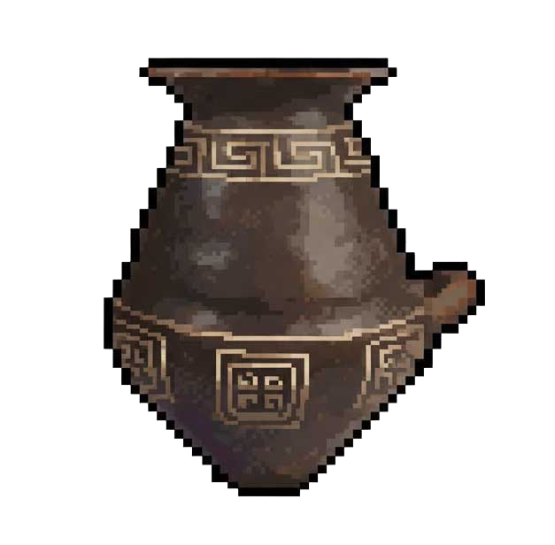

```{=html}
<style>
#title-block-header {
  display: none !important;
}
</style>

<!-- Hero -->
<div class="archaeo-drafting-hero">
  <div style="display: flex; align-items: center; gap: 2rem; flex-wrap: wrap-reverse;">
    <div style="flex: 3 1 340px; min-width: 280px;">
      <h1 class="drafting-hero-title">PyPottery</h1>

      <p class="drafting-hero-lead hero-lead-primary">
        Manually inking vessel drawings, building catalogue entries by hand from old publications, retyping the
        notes off a stack of inventory cards, working out reduction scales by hand: this is where most of the
        time in ceramic documentation actually goes, and it's a large part of why so much excavated material sits
        in a drawer for years before it ever gets published.
      </p>

      <p class="drafting-hero-lead">
        PyPottery is a suite of five open-source tools that
        takes on each of these tasks computationally: extracting figures from monograph PDFs, digitizing field
        drawings, turning pencil sketches into publication-ready ink, tracing vessel profiles into clean vector
        curves, and assembling typological plates in seconds.
      </p>

      <div class="hero-actions">
        <a href="suite_installation.html" class="btn-editorial-primary">Install the suite <i class="bi bi-arrow-right"></i></a>
        <a href="#suite-modules" class="btn-editorial-secondary">Explore the five modules</a>
      </div>

      <p class="hero-note">
        Everything runs on your own machine (You can use remote models to simplify certain tasks). The full source code is public, so anyone can check exactly how it works - and improve it.
      </p>
    </div>
    
  </div>
</div>

<hr class="hero-pipeline-hr">
```

## Suite Modules: The Archaeological Pipeline {#suite-modules}

Five integrated modules orchestrated into three operational phases, transforming raw archaeological field data and historical monographs into publication-grade plates and structured data.

```{=html}
<div class="archaeo-pipeline-container">

  <!-- =========================================================================
       PHASE 01: INGESTION & DATA CAPTURE
       ========================================================================= -->
  <div class="pipeline-stage-card phase-ingestion">
    <div class="pipeline-stage-header">
      <div class="pipeline-stage-title-group">
        <h3 class="pipeline-stage-title">From Physical Books &amp; Legacy PDFs to Structured Data</h3>
        <p class="pipeline-stage-lead">
          Automates the tedious hours spent screenshotting monograph tables or hand-cropping drawing plates and retyping handwritten field notes — cutting transcription time by roughly 90%.
        </p>
      </div>
    </div>

    <!-- 3-Box Flow Strip: Input ➔ Core AI ➔ Output -->
    <div class="pipeline-flow-strip">
      <!-- 1. Input -->
      <div class="pipeline-flow-box">
        <div class="flow-box-icon">
          <i class="bi bi-file-earmark-pdf"></i>
        </div>
        <div class="flow-box-content">
          <div class="flow-box-title">Monographs &amp; Cards</div>
          <div class="flow-box-details">PDF reports, scanned *cards*, handwritten notes</div>
        </div>
      </div>

      <!-- Arrow -->
      <div class="pipeline-flow-arrow">
        <i class="bi bi-arrow-right"></i>
      </div>

      <!-- 2. Core AI -->
      <div class="pipeline-flow-box engine-box">
        <div class="flow-box-icon engine-icon">
          <i class="bi bi-cpu"></i>
        </div>
        <div class="flow-box-content">
          <div class="flow-box-title">YOLOv8 + OCR + LLMs</div>
          <div class="flow-box-details">Vessel bounding-box detection, field handwriting OCR, and metadata structuring</div>
        </div>
      </div>

      <!-- Arrow -->
      <div class="pipeline-flow-arrow">
        <i class="bi bi-arrow-right"></i>
      </div>

      <!-- 3. Output -->
      <div class="pipeline-flow-box">
        <div class="flow-box-icon">
          <i class="bi bi-database-check"></i>
        </div>
        <div class="flow-box-content">
          <div class="flow-box-title">Segmented Corpora</div>
          <div class="flow-box-details">Standardized card crops, linked inventory tables (<code>.xlsx</code> or <code>.csv</code>), structured catalog records</div>
        </div>
      </div>
    </div>

    <!-- Dedicated Tools Subgrid -->
    <div class="pipeline-subtools-grid">
      <!-- Tool 1: Lens -->
      <div class="pipeline-tool-card">
        <div>
          <div class="pipeline-tool-top">
            
            <div class="pipeline-tool-meta">
              <div class="pipeline-tool-name-line">
                <h4 class="pipeline-tool-name">PyPotteryLens</h4>
                <span class="module-ver-badge">v0.2.1</span>
              </div>
              <p class="pipeline-tool-desc">
                Mines published monographs and excavation report PDFs, detecting and segmenting pottery drawings with Computer Vision.
              </p>
            </div>
          </div>
          <p class="pipeline-tool-caps"><span class="cap-lead">YOLO Detection</span> · Interactive Review · LLM Metadata · Cards Export</p>
        </div>
        <div class="pipeline-tool-actions">
          <a href="pypotterylens/index.html" class="btn-editorial-primary btn-sm">Documentation →</a>
          <a href="https://github.com/lrncrd/PyPotteryLens" target="_blank" rel="noopener noreferrer" class="btn-editorial-github btn-sm" title="PyPotteryLens on GitHub">
            <i class="bi bi-github"></i> GitHub
          </a>
        </div>
      </div>

      <!-- Tool 2: Scan -->
      <div class="pipeline-tool-card">
        <div>
          <div class="pipeline-tool-top">
            
            <div class="pipeline-tool-meta">
              <div class="pipeline-tool-name-line">
                <h4 class="pipeline-tool-name">PyPotteryScan</h4>
                <span class="module-ver-badge">v0.2.0</span>
              </div>
              <p class="pipeline-tool-desc">
                Digitizes handwritten drawing tables on index cards: segments multi-sherd plates, reads context notes via OCR, and outputs relational Excel tables.
              </p>
            </div>
          </div>
          <p class="pipeline-tool-caps"><span class="cap-lead">Handwriting OCR</span> · Auto Vessel Cropping · Relational Excel</p>
        </div>
        <div class="pipeline-tool-actions">
          <a href="pypotteryscan/index.html" class="btn-editorial-primary btn-sm">Documentation →</a>
          <a href="https://github.com/lrncrd/PyPotteryScan" target="_blank" rel="noopener noreferrer" class="btn-editorial-github btn-sm" title="PyPotteryScan on GitHub">
            <i class="bi bi-github"></i> GitHub
          </a>
        </div>
      </div>
    </div>
  </div>

  <!-- Connector: Phase 1 -> Phase 2 -->
  <div class="pipeline-stage-connector">
    <div class="pipeline-connector-line"></div>
    <div class="pipeline-connector-pill">
      <i class="bi bi-arrow-down"></i> Isolated Vessel Drawings
    </div>
  </div>

  <!-- =========================================================================
       PHASE 02: INKING & VECTOR GEOMETRY
       ========================================================================= -->
  <div class="pipeline-stage-card phase-inking">
    <div class="pipeline-stage-header">
      <div class="pipeline-stage-title-group">
        <h3 class="pipeline-stage-title">From Faded Pencil to Crisp SVG Vector Curves</h3>
        <p class="pipeline-stage-lead">
          Replaces the manual ordeal of tracing paper and point-by-point bezier retracing in vector software.
        </p>
      </div>
    </div>

    <!-- 3-Box Flow Strip: Input ➔ Core AI ➔ Output -->
    <div class="pipeline-flow-strip">
      <!-- 1. Input -->
      <div class="pipeline-flow-box">
        <div class="flow-box-icon">
          <i class="bi bi-pencil"></i>
        </div>
        <div class="flow-box-content">
          <div class="flow-box-title">Pencil Sketches &amp; Scans</div>
          <div class="flow-box-details">Graph paper drawings, faded graphite, raster pottery figures</div>
        </div>
      </div>

      <!-- Arrow -->
      <div class="pipeline-flow-arrow">
        <i class="bi bi-arrow-right"></i>
      </div>

      <!-- 2. Core AI -->
      <div class="pipeline-flow-box engine-box">
        <div class="flow-box-icon engine-icon">
          <i class="bi bi-magic"></i>
        </div>
        <div class="flow-box-content">
          <div class="flow-box-title">Diffusion Model + SAM 2</div>
          <div class="flow-box-details">Custom one-step diffusion for archaeological line weight &amp; Segment Anything 2 for geometry</div>
        </div>
      </div>

      <!-- Arrow -->
      <div class="pipeline-flow-arrow">
        <i class="bi bi-arrow-right"></i>
      </div>

      <!-- 3. Output -->
      <div class="pipeline-flow-box">
        <div class="flow-box-icon">
          <i class="bi bi-vector-pen"></i>
        </div>
        <div class="flow-box-content">
          <div class="flow-box-title">Archival Ink &amp; Clean SVG</div>
          <div class="flow-box-details">Pure high-contrast ink drawings and separated Bézier splines of each archaeological element (rim, profile, section)</div>
        </div>
      </div>
    </div>

    <!-- Dedicated Tools Subgrid -->
    <div class="pipeline-subtools-grid">
      <!-- Tool 3: Ink -->
      <div class="pipeline-tool-card">
        <div>
          <div class="pipeline-tool-top">
            
            <div class="pipeline-tool-meta">
              <div class="pipeline-tool-name-line">
                <h4 class="pipeline-tool-name">PyPotteryInk</h4>
                <span class="module-ver-badge">v2.1.0</span>
              </div>
              <p class="pipeline-tool-desc">
                Transforms pencil sketches into publication-grade ink drawings in seconds using a dedicated diffusion architecture.
              </p>
            </div>
          </div>
          <p class="pipeline-tool-caps"><span class="cap-lead">Diffusion</span> · Diagnostic Line Weight · Batch Processing · CUDA / MPS / CPU</p>
        </div>
        <div class="pipeline-tool-actions">
          <a href="pypotteryink/index.html" class="btn-editorial-primary btn-sm">Documentation →</a>
          <a href="https://github.com/lrncrd/PyPotteryInk" target="_blank" rel="noopener noreferrer" class="btn-editorial-github btn-sm" title="PyPotteryInk on GitHub">
            <i class="bi bi-github"></i> GitHub
          </a>
        </div>
      </div>

      <!-- Tool 4: Trace -->
      <div class="pipeline-tool-card">
        <div>
          <div class="pipeline-tool-top">
            
            <div class="pipeline-tool-meta">
              <div class="pipeline-tool-name-line">
                <h4 class="pipeline-tool-name">PyPotteryTrace</h4>
                <span class="module-ver-badge">v0.2.0</span>
              </div>
              <p class="pipeline-tool-desc">
                Interactive profile vectorization powered by SAM 2: click on drawing elements to generate editable, smoothed Bézier curves.
              </p>
            </div>
          </div>
          <p class="pipeline-tool-caps"><span class="cap-lead">SAM 2 Interactive</span> · Bézier Spline Editor · Layered SVG Export</p>
        </div>
        <div class="pipeline-tool-actions">
          <a href="pypotterytrace/index.html" class="btn-editorial-primary btn-sm">Documentation →</a>
          <a href="https://github.com/lrncrd/PyPotteryTrace" target="_blank" rel="noopener noreferrer" class="btn-editorial-github btn-sm" title="PyPotteryTrace on GitHub">
            <i class="bi bi-github"></i> GitHub
          </a>
        </div>
      </div>
    </div>
  </div>

  <!-- Connector: Phase 2 -> Phase 3 -->
  <div class="pipeline-stage-connector">
    <div class="pipeline-connector-line"></div>
    <div class="pipeline-connector-pill">
      <i class="bi bi-arrow-down"></i> Refined Vector Profiles
    </div>
  </div>

  <!-- =========================================================================
       PHASE 03: SYNTHESIS & PUBLISHING
       ========================================================================= -->
  <div class="pipeline-stage-card phase-synthesis">
    <div class="pipeline-stage-header">
      <div class="pipeline-stage-title-group">
        <h3 class="pipeline-stage-title">From Individual Vessels to Publication-Ready Plates</h3>
        <p class="pipeline-stage-lead">
          Eliminates hand-recalculated reduction scales, hand-drawn millimeter bars, and tedious manual alignment of figures on the page.
        </p>
      </div>
    </div>

    <!-- 3-Box Flow Strip: Input ➔ Core AI ➔ Output -->
    <div class="pipeline-flow-strip">
      <!-- 1. Input -->
      <div class="pipeline-flow-box">
        <div class="flow-box-icon">
          <i class="bi bi-collection"></i>
        </div>
        <div class="flow-box-content">
          <div class="flow-box-title">Vector Figures &amp; SVGs</div>
          <div class="flow-box-details">Individual vessel vectors, inking outputs, contextual catalog metadata</div>
        </div>
      </div>

      <!-- Arrow -->
      <div class="pipeline-flow-arrow">
        <i class="bi bi-arrow-right"></i>
      </div>

      <!-- 2. Core AI -->
      <div class="pipeline-flow-box engine-box">
        <div class="flow-box-icon engine-icon">
          <i class="bi bi-aspect-ratio"></i>
        </div>
        <div class="flow-box-content">
          <div class="flow-box-title">Deterministic Vector Engine</div>
          <div class="flow-box-details">True DPI scale bar calibration, standardized reduction (1:3, 1:4), automated grid layout</div>
        </div>
      </div>

      <!-- Arrow -->
      <div class="pipeline-flow-arrow">
        <i class="bi bi-arrow-right"></i>
      </div>

      <!-- 3. Output -->
      <div class="pipeline-flow-box">
        <div class="flow-box-icon">
          <i class="bi bi-file-earmark-richtext"></i>
        </div>
        <div class="flow-box-content">
          <div class="flow-box-title">Publication Plates</div>
          <div class="flow-box-details">Print-ready vector PDF &amp; SVG plates, calibrated scale bars, automated catalog numbering</div>
        </div>
      </div>
    </div>

    <!-- Dedicated Tools Subgrid -->
    <div class="pipeline-subtools-grid">
      <!-- Tool 5: Layout -->
      <div class="pipeline-tool-card" style="grid-column: 1 / -1;">
        <div>
          <div class="pipeline-tool-top">
            
            <div class="pipeline-tool-meta">
              <div class="pipeline-tool-name-line">
                <h4 class="pipeline-tool-name">PyPotteryLayout</h4>
                <span class="module-ver-badge">v0.2.0</span>
              </div>
              <p class="pipeline-tool-desc">
                Composes multi-vessel publication plates with automatic metric scaling, calibrated scale bars, typological grouping, and editable vector PDF/SVG export.
              </p>
            </div>
          </div>
          <p class="pipeline-tool-caps"><span class="cap-lead">Automatic Layout</span> · Calibrated Metric Scale Bars · Automated Metadata Placement &amp; Numbers · Vector PDF &amp; SVG</p>
        </div>
        <div class="pipeline-tool-actions">
          <a href="pypotterylayout/index.html" class="btn-editorial-primary btn-sm">Documentation →</a>
          <a href="https://github.com/lrncrd/PyPotteryLayout" target="_blank" rel="noopener noreferrer" class="btn-editorial-github btn-sm" title="PyPotteryLayout on GitHub">
            <i class="bi bi-github"></i> GitHub
          </a>
        </div>
      </div>
    </div>
  </div>

</div>
```

## Getting Started {#getting-started}

::: {.prose}

PyPottery is designed as an entirely **modular suite** rather than an all-or-nothing pipeline: you choose exactly how to use it according to your workflow, research needs, and personal documentation preferences:

- **Don't need profile vectorization?** You don't have to use [PyPotteryTrace](pypotterytrace/index.html): keep your high-contrast inked drawings as your final raster publication figures.
- **Prefer assembling catalog plates by hand?** If physical layout and manual composition aid your typological reasoning and ceramic classification, you don't have to use [PyPotteryLayout](pypotterylayout/index.html): simply take the drawings from Ink, Scan, or Lens straight into your vector graphic editor or drafting desk.
- **Only need specific extraction tasks?** Use [PyPotteryScan](pypotteryscan/index.html) solely for transcribing handwritten cards into Excel, or [PyPotteryLens](pypotterylens/index.html) just to mine monograph plates, without touching the downstream drawing tools.

For hardware requirements and environment setup on Windows, macOS, and Linux, see [System Requirements](requirements.html) and the [Suite Installation Guide](suite_installation.html).

:::

## Why PyPottery {#why-pypottery}

### Made by archaeologists for archaeologists {#tested-with-archaeologists}

::: {.prose}

The idea for PyPottery grew out of a set of needs the author first ran into during university: let's be honest,
documenting pottery isn't boring work, but it is work that takes a great deal of time. That "lost" time takes
away from the other stages of research like typological analysis, comparison with other contexts, writing up
results. PyPottery exists to drastically cut the time spent on repetitive, mechanical tasks, leaving more room
for interpretation and research.

Using PyPottery has been shown to cut documentation time by roughly **60 times** compared to the traditional
routine of tracing paper, technical pens, and manually re-tracing everything in vector software.

::: {.key-point}
That doesn't mean it gets everything right on the first pass: a transcribed word sometimes needs a correction, a traced profile sometimes needs a nudge. PyPottery is built around a concept called *Human-in-the-Loop*: **every stage gives you the chance to check and correct before moving on**, so what comes out the other end is something you stand behind, not something you're asked to trust blindly.
:::

:::

### From the Old Workflow to the New One {#the-archaeological-documentation-workflow}

::: {.prose}

None of this replaces the archaeologist's eye — the interpretive drawing itself, deciding what a fragment tells you, still starts on paper. What changes is everything that happens *after* that: the hours of repetitive work standing between a first pencil sketch and a page ready to send to a publisher.

:::

::: {.workflow-stage}

#### Getting the material in

::: {.workflow-stage-body}

::: {.stage-before}

::: {.stage-label}
The routine
:::

If you're starting from a stack of hand-written excavation cards, the routine is usually: scan each card, open Photoshop or a similar program and crop out every drawing by hand, then read the context, stratigraphic unit, and inventory number off the card — often in decades-old handwriting — and type them into a spreadsheet, one row at a time. If you're starting from a published monograph instead, it typically means taking screenshots of PDF pages one by one and re-cataloguing the plates yourself.

:::

::: {.stage-after}

::: {.stage-label}
With PyPottery
:::

[PyPotteryScan](pypotteryscan/index.html) and [PyPotteryLens](pypotterylens/index.html) take over this stage. Scan reads the drawings sheets and fills in the spreadsheet for you, so you're checking and correcting rather than transcribing from scratch. Lens goes straight through a PDF and pulls out every figure automatically, no screenshotting involved.

:::

:::

:::

::: {.workflow-stage}

#### Turning pencil into a finished drawing

::: {.workflow-stage-body}

::: {.stage-before}

::: {.stage-label}
The routine
:::

This is traditionally where most of the hours disappear. A pencil drawing gets taped over with tracing film and gone over by hand with a technical pen to produce clean, publishable ink lines — and if you also need an editable digital version, it gets traced a second time, point by point, in Illustrator, Inkscape or similar software.

:::

::: {.stage-after}

::: {.stage-label}
With PyPottery
:::

[PyPotteryInk](pypotteryink/index.html) takes the pencil scan and produces the finished ink version directly. [PyPotteryTrace](pypotterytrace/index.html) then turns that into an editable vector drawing, with the section, building-lines, decoration kept as separate elements you can still adjust — not one flat outline.

:::

:::

:::

::: {.workflow-stage}

#### Getting it ready for publication

::: {.workflow-stage-body}

::: {.stage-before}

::: {.stage-label}
The routine
:::

Finally, individual drawings have to become a plate: arranging images on the page, working out the correct reduction scale for each one by hand, drawing scale bars, and typing captions and catalogue numbers.

:::

::: {.stage-after}

::: {.stage-label}
With PyPottery
:::

[PyPotteryLayout](pypotterylayout/index.html) arranges the plate automatically — consistent scale, positioning, and captions across the whole page — and still hands you back a file you can open and fine-tune in your usual software afterward.

:::

:::

:::

### Methodological Principles {#methodological-principles}

```{=html}
<dl class="principles-list">

  <div class="principle">
    <dt>You stay in charge</dt>
    <dd>
      <p class="principle-title">Automation stops where judgment starts</p>
      <p class="principle-text">
        PyPottery automates the mechanical parts — cropping, transcribing, inking, laying out — never the
        archaeological judgment. Every output is something to check and confirm, not something asked to be
        trusted blindly.
      </p>
    </dd>
  </div>

  <div class="principle">
    <dt>Modular by design</dt>
    <dd>
      <p class="principle-title">A toolkit, not a rigid pipeline</p>
      <p class="principle-text">
        PyPottery adapts to your workflow, not the other way around. Don't need profile vectorization?
        Skip Trace. Prefer manual plate layout to aid typological classification? Skip Layout.
        Automate only what you need and retain full research control.
      </p>
    </dd>
  </div>

  <div class="principle">
    <dt>Local by default</dt>
    <dd>
      <p class="principle-title">Your data stays on your machine</p>
      <p class="principle-text">
        Unpublished excavation data, stratigraphic coordinates, drawings, notes: all of it stays on your computer,
        with no account and no telemetry. The one exception is metadata extraction in PyPotteryLens, which
        currently calls a cloud LLM — the best option available today for that specific task.
      </p>
    </dd>
  </div>

  <div class="principle">
    <dt>Free &amp; inspectable</dt>
    <dd>
      <p class="principle-title">Open source, not a black box</p>
      <p class="principle-text">
        No license fees, no proprietary format locking your work in. The full source code is public, so anyone can
        check exactly how it works — and improve it.
      </p>
    </dd>
  </div>

  <div class="principle">
    <dt>Runs on laptops</dt>
    <dd>
      <p class="principle-title">Built for consumer hardware</p>
      <p class="principle-text">
        No research-grade GPU required. PyPottery is developed and tested on ordinary laptops and desktops, with a
        CPU-only fallback for every module. Just a gaming laptop or a MacBook is enough to run the whole suite.
      </p>
    </dd>
  </div>

</dl>
```

## Academic Citations {#academic-citations}

If you use PyPottery tools in academic publications, excavation reports, or museum catalogues, please cite the corresponding peer-reviewed articles:

```{=html}
<div class="pub-editorial-grid">

  <div class="pub-editorial-card">
    <div>
      <span class="pub-journal-pill">Elsevier DAACH • 2025</span>
      <h3 class="pub-editorial-title">PyPotteryLens: An Open-Source Framework for Automated Pottery Digitisation</h3>
      <div class="pub-editorial-authors">Lorenzo Cardarelli (2025)</div>
      <div class="pub-editorial-meta">
        <em>Digital Applications in Archaeology and Cultural Heritage</em>, e00380
      </div>
    </div>
    <div class="pub-actions">
      <a href="https://doi.org/10.1016/j.daach.2025.e00380" target="_blank" rel="noopener noreferrer" class="btn-editorial-primary">
        <i class="bi bi-box-arrow-up-right"></i> DOI: 10.1016/j.daach.2025.e00380
      </a>
    </div>
  </div>

  <div class="pub-editorial-card">
    <div>
      <span class="pub-journal-pill">Elsevier JCH • 2025</span>
      <h3 class="pub-editorial-title">PyPotteryInk: A One-Step Diffusion Model for Archaeological Drawing Vectorization</h3>
      <div class="pub-editorial-authors">Lorenzo Cardarelli (2025)</div>
      <div class="pub-editorial-meta">
        <em>Journal of Cultural Heritage</em>, 10.1016/j.culher.2025.01.010
      </div>
    </div>
    <div class="pub-actions">
      <a href="https://doi.org/10.1016/j.culher.2025.01.010" target="_blank" rel="noopener noreferrer" class="btn-editorial-primary">
        <i class="bi bi-box-arrow-up-right"></i> DOI: 10.1016/j.culher.2025.01.010
      </a>
    </div>
  </div>

</div>
```

```{=html}
<!-- Support & Repository Box -->
<div class="archaeo-cta-box">
  <h3 class="archaeo-cta-title">Open Source, Independently Maintained</h3>
  <p class="archaeo-cta-desc">
    PyPottery is developed as an independent open-source project for the archaeological community. Source code,
    pretrained models, and issue tracking are on GitHub.
  </p>
  <div class="archaeo-cta-buttons">
    <a href="https://github.com/lrncrd/PyPottery" target="_blank" rel="noopener noreferrer" class="btn-editorial-github">
      <i class="bi bi-github"></i> PyPottery on GitHub
    </a>
    <a href="https://ko-fi.com/lrncrd" target="_blank" rel="noopener noreferrer" class="btn-editorial-secondary">
      <i class="bi bi-cup-hot"></i> Support on Ko-fi
    </a>
  </div>
</div>
```
