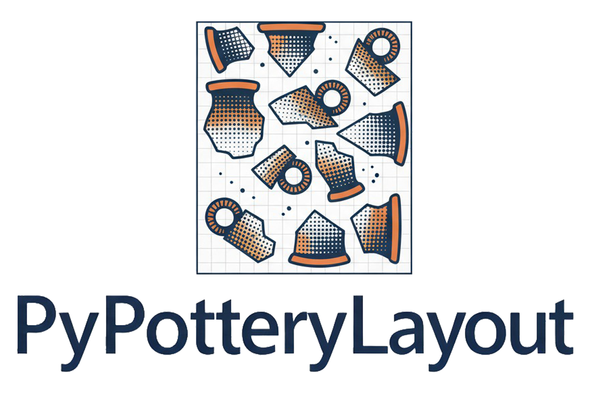

  

PyPotteryLayout turns a folder of pottery drawings into publication plates: it sorts the drawings, scales them, places them on pages and adds captions, numbers and a scale bar. This guide follows the app in the order you will normally use it. The **Need help?** button in the header (Pixel) opens this page, and the **Info** button shows the version, a ready-to-copy citation and the hardware the app detected.

::: {.callout-note}
## The workflow at a glance
**Import** the images (and a spreadsheet) → choose the **layout** → set **sorting**, **captions** and the **scale bar** → check the live **preview** → **Generate Layout** and download
:::

## The screen

The window has two columns. On the left, the settings: a **Basic Settings** tab (files, layout mode, page size, export format) and an **Advanced Settings** tab (scale, margins, captions, numbering, sorting, scale bar), with the **Generate Layout** and **Clear All** buttons at the bottom. On the right, **Output & Preview** shows the plate as it will look and, when you generate it, the result. The preview updates by itself while you change the settings.

## Key terms

| Term | Meaning |
|---|---|
| **Plate** | One page of the output. |
| **Grid** | A layout with rows and columns of drawings. |
| **Puzzle** | A layout that packs the drawings to waste as little space as possible. |
| **Metadata** | A spreadsheet with the data of each piece (type, period, inventory number, ...). |
| **Primary / secondary sort** | The criteria that decide the order of the drawings: the second one breaks the ties of the first. |
| **Group** | The drawings that share the same primary sort value (for example the same type). |
| **Px / cm** | The resolution of your drawings, used to draw the scale bar at the right length. |

# Import the data

## Images

Drag the drawings onto the upload area, or click it to choose them (PNG, JPG, TIF, TIFF or BMP). Large sets are uploaded in batches, and a window with a progress bar follows the upload and the generation of the first preview. Uploading again **replaces** the previous set of images (the spreadsheet stays). Drawings with a transparent background (such as the PNG files exported by PyPotteryTrace) are placed on the white page.

::: {.callout-note}
## File names
The app stores the images with a cleaned-up name: spaces and special characters become `_` and accents are removed (*Bowl 01 (a).png* becomes *Bowl_01_a.png*, *tazza à.png* becomes *tazza_a.png*). The captions show this cleaned-up name.
:::

## Metadata (optional)

Choose an Excel (`.xlsx`) or CSV (`.csv`) file. The **first row** must contain the column names, and the **first column** must contain the name of the image the row describes; the app then reports how many records it loaded. The other columns become available for **sorting** and for the **captions**. In an Excel file, only the active sheet is read.

The link between a row and an image is forgiving. It ignores the extension of the image, upper and lower case, and the same cleaning-up of spaces and special characters that is applied to the file names. So the image `Bowl_01.png` is matched by the id `Bowl 01`, `bowl_01` or `Bowl_01.png` alike, and an id such as `US.12` is kept whole. Images without a row in the spreadsheet are still placed, with the file name as their only caption, and go last when you sort by a spreadsheet field.

# Layout

These settings are in the **Basic Settings** tab.

- **Layout Mode**:
    - **Grid**: rows and columns. Best for systematic catalogues.
    - **Puzzle**: a packing algorithm (without rotating the drawings) fills each page as much as it can. Best for drawings of very different sizes. The order of the drawings within a page can differ from the sorting order, because the algorithm chooses the places.
- **Page Size**: **A4** (2480 × 3508 px), **A3** (3508 × 4961 px), **Letter** (2550 × 3300 px), **HD** (1920 × 1080 px) or **4K** (3840 × 2160 px). The paper sizes are at 300 dpi.
- **Export Format**: **PDF**, **SVG** or **JPG**, see [Generate and export](#generate-and-export).
- **Rows per page** and **Cols per page** (Grid only, 1 to 10; 4 and 3 by default): these are **maximums**. The drawings keep their scaled size and are never stretched: a row takes fewer drawings than the columns you asked for when they do not fit in the width, and a page takes at most the rows you asked for. A drawing wider than the page is placed alone on its row.

# Dimensions and spacing

These settings are in the **Advanced Settings** tab, in **Dimensions & Spacing**.

- **Image Scale**: how big the drawings are on the plate. Use **Decimal** (0.10 to 2.00, in steps of 0.05; 0.40 by default) for a multiplier of the original size, or **Ratio (1:N)** to type it as a ratio (for example `1:2`, which is 0.5).
- **Margin (px)**: the white space around the page (50 by default).
- **Top Space (px)**: extra space added to the top margin, between the page border and the first row (40 by default). It leaves room for the plate number when it is at the top.
- **Spacing (px)**: the gap between drawings (10 by default).
- **Vertical Alignment** (Grid only): **Center** (default) centres the rows vertically on the page; **Top** starts them under the top margin.
- **Show Margin Border**: draws a rectangle at the margins, in every output format. The plate number is moved inside it so that it does not touch the line.

# Sorting and grouping

These settings are in **Sorting & Grouping**.

- **Primary Sort**: **Alphabetical**, **Natural** (1, 2, 10 instead of 1, 10, 2), **Random**, or any **field of your spreadsheet** (numbers are ordered as numbers, text alphabetically). The **Random** order is the same in the preview and in the exported file; choose it again to shuffle anew.
- **Secondary Sort**: it orders the drawings that have the same primary value. It is available when a spreadsheet is loaded.
- **Enable primary sort grouping**: every time the primary value changes, a new group starts.
    - **New page**: the group starts on a new page.
    - **Horizontal divider line** (Grid only): the group starts after a line on the same page, with a **Thickness** (5 px by default) and a **Width** as a percentage of the printable width (80% by default).

  In Puzzle mode every group always starts on a new page.
- **Show sort value as chapter title**: prints the primary value once, at the start of each group, right-aligned in the top margin, like a book chapter heading. **Title Font Size** sets its size (16 by default). Use it together with grouping: in Puzzle mode, without it the title appears only once for the whole document.

# Captions and numbering

These settings are in **Captions & Numbering**.

## Captions

**Enable Captions** (on by default) writes a caption under every drawing, centred. It always starts with the file name, followed by the spreadsheet fields you select in **Metadata Fields** (all of them are selected by default; if you untick them all, only the file name is written).

- **Font Size** (12 pt by default) and **Padding** (5 px by default, the space around the text).
- **Remove file extension**: writes `Bowl_01` instead of `Bowl_01.png`.
- **Hide field names**: writes only the values (*bowl*) instead of *Type: bowl*.

## Object numbers

**Add Object Number** (off by default) gives every drawing its own number, `1, 2, 3...`, starting again from 1 on each page. **Position**: **Below (Center)** under the drawing, or **Bottom Left** / **Bottom Right** inside its corner. **Font Size**: 18 by default.

## Table numbers

**Add Table Numbers** (on by default) writes the plate number on every page, for example *Tav. 1*, *Tav. 2*, ...

- **Prefix**: the text before the number (*Tav.* by default; use *Pl.*, *Fig.*, ...).
- **Start #**: the number of the first plate (1 by default).
- **Font Size** (18 by default) and **Position** (top left by default, or top right, bottom left, bottom right).

# Scale bar

**Add Scale Bar** (on by default) draws a bar in the bottom right corner of every page, inside the margin, with alternating black and white centimetres.

- **Scale (cm)**: the length the bar represents (5 by default).
- **Px / cm**: **the resolution of your drawings**, that is how many pixels of the original image make one real centimetre (118 by default, about 300 dpi). The bar is drawn at this length multiplied by the **Image Scale**, so it stays correct when you change the scale. If this value is wrong, the scale bar is wrong: set it to the resolution you used when you scanned or exported the drawings.

# Preview

As soon as the images are loaded, the **Live Preview** shows the first page of the plate, and it updates about half a second after every change of the settings (**Update Preview** forces it). Click the preview to see it larger. Below it, a badge tells you how many images and pages the preview covers.

To stay fast, the preview uses only the **first 25 drawings** in the chosen order; when your set is larger, a notice says so, and the page count refers to those 25. The generated file always contains all the drawings.

# Generate and export

Click **Generate Layout**. A progress message follows the work; when it ends, the result shows the file name and the number of pages, and **Download File** saves it.

| Format | Result |
|---|---|
| **PDF** | One multi-page file, at 300 dpi |
| **JPG** | One image per page, at 300 dpi and high quality. With more than one page, the images come in a ZIP file |
| **SVG** | One vector file per page (a ZIP file when there is more than one page). Captions, plate numbers, object numbers and the scale bar remain **editable text and shapes** in Inkscape or Adobe Illustrator |

**Clear All** removes the uploaded images, the spreadsheet and the generated files, so you can start a new plate set.

# Tips

- **Check the Px / cm value first**: it is the one setting that makes the scale bar true.
- **Sort by a spreadsheet field and turn on the chapter title** (with grouping) to get a plate set organized by type or period, with the heading printed for you.
- **Use Grid for regular catalogues, Puzzle for mixed sizes.** If the plates look empty, raise the **Image Scale**; if drawings do not fit, lower it or use fewer columns.
- **Fine-tune in SVG.** Export as SVG when you want to adjust captions or positions by hand in a vector program.
