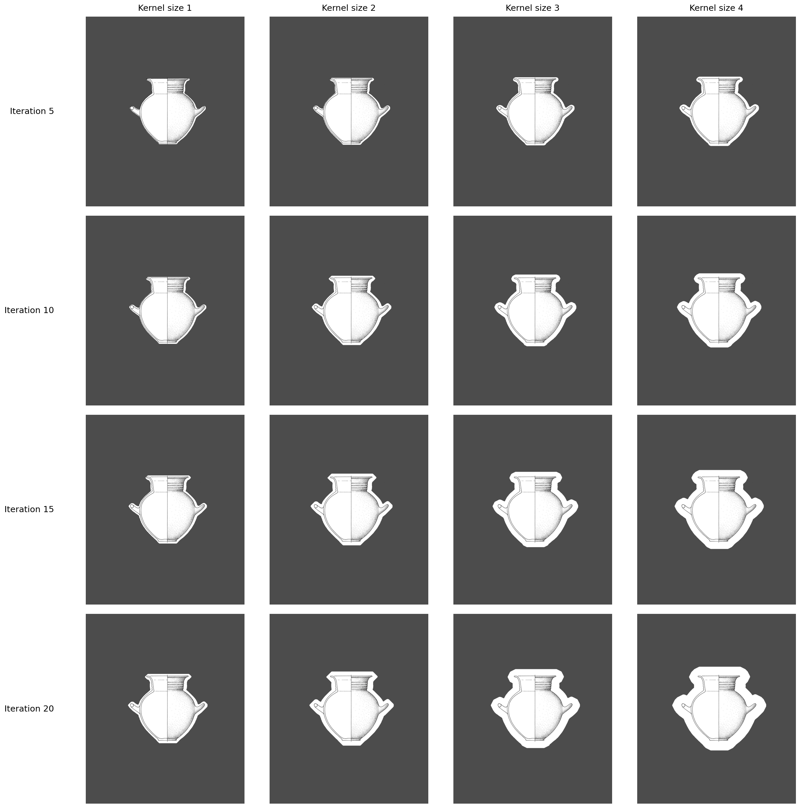

<div style="text-align: center;">
  
  <br>
  </span>
</div>

```{=html}
<div style="
    background: linear-gradient(135deg, #fdfbfb 0%, #ebedee 100%);
    border: 1px solid #e1e4e8;
    border-left: 5px solid #c2410c;
    border-radius: 12px;
    padding: 15px 25px;
    margin: 20px 0;
    display: flex;
    align-items: center;
    justify-content: space-between;
    box-shadow: 0 4px 15px rgba(0,0,0,0.05);
">
    <div style="font-family: 'Segoe UI', sans-serif; color: #4a5568; max-width: 70%;">
        <div style="font-size: 1.25em; font-weight: 700; color: #2d3748; margin-bottom: 5px;">
            Need a hand?
        </div>
        <div style="line-height: 1.5;">
            Look for <strong style="color: #c2410c;">Pixel</strong> in the app! <br>
            Clicking on him brings you straight back to this guide.
        </div>
    </div>
    <div style="flex-shrink: 0; display: flex; align-items: center; justify-content: center;">
         <iframe src="../animations/pixel_assistant.html" style="width: 220px; height: 120px; border: none; overflow: hidden;" scrolling="no"></iframe>
    </div>
</div>
```


# GUI Overview

The program is composed of a series of tab that represent the image extraction process:

- **Project Manager**
- **PDF Document Processing**
- **Apply Model**
- **Review Annotations and extract masks**
- **Tabular Information**
- **Post Processing**

## Project Manager

Like other tools in the PyPottery suite, PyPotteryLens uses a project management system.

You can create a project by entering a name in the text box, along with an optional description and an icon.

Once created, the project will appear in the "**Your Projects**" list.

Selecting a project will display its name in the status bar.

<iframe src="animations/project_create.html" style="width: 100%; height: 600px; border: none; overflow: hidden;" scrolling="no"></iframe>

## PDF Document Processing

In this tab, you can upload and process a PDF file, transforming it into a series of images.

<iframe src="animations/pdf_process.html" style="width: 100%; height: 900px; border: none; overflow: hidden;" scrolling="no"></iframe>

Clicking on **Upload PDF to current project** will open a dialog window to select the PDF file.

::: {.callout-important}
The **Split Scanned** checkbox must be checked **BEFORE** selecting the file if the PDF to be processed has 2 pages side-by-side.

<div style="display: flex; justify-content: center; gap: 20px; align-items: center; margin-top: 10px;">
  
  
</div>
:::

Once the PDF is processed, you can proceed to the next tab.

## Apply Model

In this tab, you can use the Computer Vision (CV) model to extract information.

<iframe src="animations/apply_model.html" scrolling="no" style="width: 100%; height: 800px; border: none; border-radius: 12px; box-shadow: 0 4px 6px rgba(0,0,0,0.1); margin: 20px 0; overflow: hidden;"></iframe>

### GUI Layout

The GUI is divided into two parts:

- **Right Side**: A gallery containing the images. Clicking on an image opens it in full screen. In the top right of each image, there is an icon that allows you to exclude the page from processing. To re-include an image, simply click the checkmark again.
- **Left Side**: Contains the model parameters.

### Parameters

- **Model Selection**: Allows you to select the model to apply.
- **Model Parameters**: You can define the confidence threshold for the model as well as some post-processing operations for the masks. Here the parameters: 
  - **Confidence**: The confidence threshold for the model.
  - **Kernel size**: The size of the kernel for the post-processing operations.
  - **Iterations**: The number of iterations for the post-processing operations.
- **Advanced Options**: Includes the possibility to limit the application to 25 pages for debugging purposes.


::: {.callout-note}
The results of applying different Kernel size and Iterations are shown.

:::

Once you click on **🚀 Apply Model to Project**, a progress bar will indicate the status of the process.

::: {.callout-note}
To use a different model, place it in the appropriate folder.
:::

## Review Annotations

In this tab, you can review and modify the model's annotations.

<iframe src="animations/model_review.html" style="width: 100%; height: 700px; border: none; overflow: hidden;" scrolling="no"></iframe>

- **Left**: A list of files indicating the pages.
- **Right**: A canvas showing the image.

You can navigate between images by selecting the name or using the buttons below the image.

In the list:

- **Green Checkmark (✔️)**: Images where the model has identified vases.
- **White Dot (•)**: Images where the model has not recognized any vases.

### Editing Masks

You can modify the masks identified by the model using the buttons below the canvas:

- **🖌️ Brush**: To draw new masks.
- **🧹 Eraser**: To delete existing masks.
- **🗑️ Clear**: To delete all masks.

New masks will appear in transparent red.

Once an image without masks (white dot) is modified, the indicator will update to a green checkmark.

Changing the image or clicking on **💾 Save Current Mask** will save the changes.

Once you have reviewed the images, you can extract them by clicking on **📤 Extract Cards**.

## Tabular Information

This tab allows you to insert tabular information for the images.

<iframe src="animations/tabular_info.html" style="width: 100%; height: 600px; border: none; overflow: hidden;" scrolling="no"></iframe>

- **Center**: A canvas displaying the image where each identified element is associated with a bounding box and an ID.
- **Left**: A file list for navigation.
- **Right**: A table where you can enter tabular information.

Each record is indicated by an ID visible on the canvas. To add a column, write the name and click **➕ Add Column**.
Once the information is entered, you can click on **👁️ Mark as Reviewed**. The inserted columns are persistent across the project's images.

::: {.callout-tip}
## AI-Assisted Extraction (optional)
This tab can optionally use a local vision-language model (Gemma) to help fill in tabular fields automatically. Because this model runs entirely on your machine, PyPotteryLens first checks that your hardware is capable enough - see [Hardware Requirements](../requirements.qmd) for the exact thresholds. If your machine doesn't qualify, the option is disabled and the interface explains why, instead of attempting a slow or unstable download.
:::

## Post Processing

Finally, you can post-process the images to standardize them (e.g., profile on the right and rim facing upwards).

<iframe src="animations/post_process.html" style="width: 100%; height: 600px; border: none; overflow: hidden;" scrolling="no"></iframe>

### GUI Layout

- **Left**: List of images, processing options, and navigation buttons.
- **Right**: A double canvas (initially only the left one is active).

### Workflow

To start post-processing, click on **🔍 Process All Images**. The model will highlight the position and conservation status of the pieces. The positioned vase will appear in "Processed Image".

You can navigate through the records using the buttons and the file list.

If the model has misclassified a vase, you can manually modify the classification.

You can also set image transformations to lock specific transformations.

Once post-processing is complete, click on **📦 Export Results** to save the images in a ZIP folder.

An Excel file (.xlsx) containing the previously added tabular information will be exported along with the images.

# Project Management Details

Once created, you can reopen a project. Available projects are listed in "Your Projects" within the **Project Manager** tab.

The project card displays information about the work, such as:

- Number of images
- Number of masks and annotations
- Progress
- Creation date
- Last modification date

You can select or remove a project from this view.

:::{.callout-warning}
Removing a project will delete all associated data.
:::

# Workflow Details (v0.3)

The sections below describe in more detail the tools introduced in version 0.3.0.

## Nested Vessels (Polygon tool)

In **Review Annotations**, the **Polygon (📐)** tool lets you draw free-form polygons around vessels that are drawn *inside* other vessels. Double-click (or click near the first vertex) to close a polygon.

Each polygon becomes an independent card at extraction time, and the inner vessel area is automatically subtracted (whitened) from the containing card.

## Zoom, Pan, Brush and Colorize

- **Zoom & pan**: the canvas fits the full page on load; use the **+ / − / fit** controls or the mouse wheel to inspect details.
- **Brush (🖌️) / Eraser (🧹)**: a visible ring follows the cursor so you always know which area you are painting or erasing.
- **Colorize (🎨)**: toggles a political-map coloring where every disconnected mask region gets a distinct hue. Two regions sharing the same color are actually *fused* - use the eraser to separate them. Colors are recomputed live after each stroke.

Changes are saved automatically when you navigate away. Click **Extract Masks** when the review is complete.

## Tabular Information: AI Extraction Tips

- **Batch mode**: use **🤖 Extract AI References** for the current page, or **🔄 Extract All (Batch)** for the whole project. The backend can be OpenRouter or a local Gemma model.
- **Canonical column names**: write column names in `[square brackets]` inside the prompt (e.g. `Add also [Scale], [Context]`) to lock the exact JSON key the model will use. This prevents column names drifting across pages.
- **Numbers from crops**: enable this toggle to extract inventory/reference numbers by cropping and upscaling each individual drawing, which improves accuracy for small labels.
- **Box visibility**: an on/off switch hides or shows the bounding boxes on the canvas.
- **Clear Table**: resets all values on the current page without losing the column structure.

:::{.callout-note}
Avoid commas in cell values (CSV limitation). For bulk editing you can export and edit in Excel or Google Sheets.
:::

## Post Processing: Grid View

After clicking **Process All Images**, all pieces are shown in a proportional grid: the largest piece maps to the maximum thumbnail size, so every card is displayed at its real relative dimensions.

- **Automatic orientation**: *Auto Vertical Flip* corrects upside-down vessels (mouth facing down); *Auto Horizontal Flip* standardizes the profile side.
- **Classification**: **ENT** (substantially complete profiles, blue border) or **FRAG** (fragments, orange border).

Hover over a card to reveal its controls: flip vertical / horizontal, the ENT/FRAG pill, **✕ Exclude** (the card is skipped at export and greyed out) and a full-screen lightbox on click.

## Export

Assign a short **acronym** (e.g. `CRD`, `VEII`) to name files systematically (`{acronym}_1.png`, `{acronym}_2.png`, ...). The export is a single ZIP containing the renamed images (excluded cards are omitted) and `{acronym}_metadata.csv`, which merges the tabular data and the classifications, with all fields written as plain text. Tabular data is read directly from the working `mask_info.csv`, so no intermediate export step is needed.

## Project Folder Structure

```
projects/
└── YourProject_20250104_123456/
    ├── project.json              # Project metadata
    ├── pdf_source/               # Original PDF files
    ├── images/                   # Extracted page images
    ├── masks/                    # Detection masks (PNG with segmentation)
    ├── cards/                    # Individual pottery instances
    │   ├── mask_info.csv         # Metadata spreadsheet
    │   └── mask_info_annots.csv  # Bounding box annotations
    ├── cards_modified/           # Oriented/classified instances
    │   └── classifications.csv   # Classification results
    └── exports/                  # Final exported data
```

Projects are automatically timestamped to avoid name conflicts. Use descriptive names (e.g. `Capena_2018_Vol_II`) and avoid spaces or special characters in PDF file names (`Cardarelli_2022.pdf`, not `My Document (2024) v2.pdf`).
