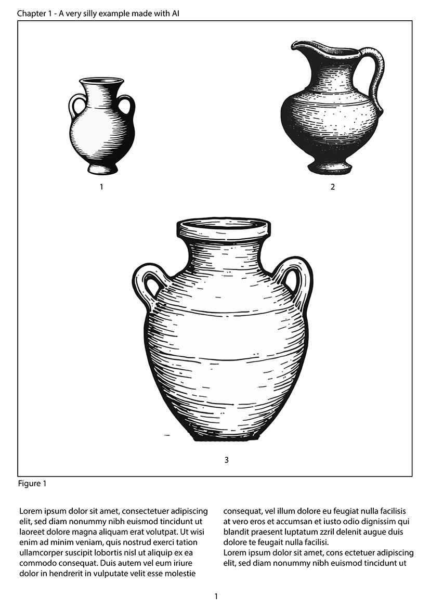
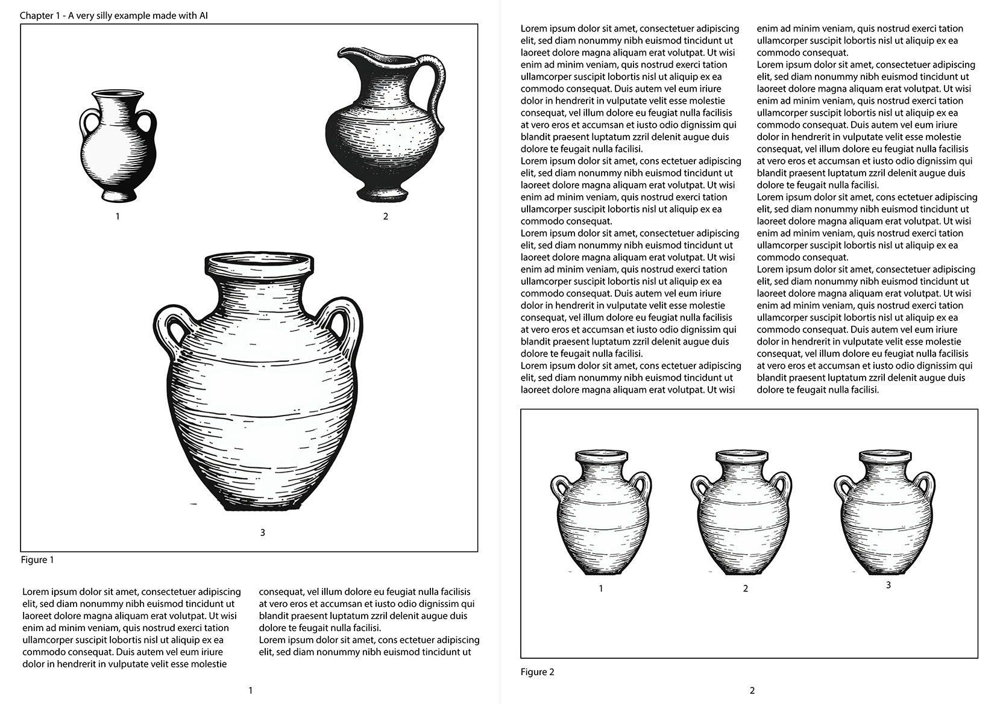

<div style="text-align: center;">
  
</div>

PyPotteryLens turns a published monograph (a PDF full of plates with pottery drawings) into a clean dataset: one image per vessel, oriented the same way, with the data you attach to it. This guide follows the app tab by tab, in the order you will use them. Every step builds on the previous one, and everything is saved automatically inside your project, so you can stop at any time and pick up later.

<!--
ANIMATION (overview, NEW, priority: medium)
Storyboard, ~12 s loop: 1) the six tab names light up one after the other
(Project Manager > 1 PDF > 2 Model > 3 Annotations > 4 Tabular > 5 Post Processing);
2) under each one a tiny thumbnail of what it produces (project card, plate pages,
masks over a plate, table, card grid); 3) final frame: the exported ZIP icon.
Purpose: give readers the map before the details.
-->

::: {.callout-note}
## The workflow at a glance
**Project Manager** → **1. PDF Document Processing** → **2. Apply Model** → **3. Review Annotations & Masks** → **4. Tabular Information** → **5. Post Processing** → **Export ZIP**
:::

<iframe src="animations/coming_soon.html" name="Workflow overview" title="Animation coming soon: Workflow overview" style="width: 100%; height: 260px; border: none; overflow: hidden;" scrolling="no"></iframe>

## Key terms

| Term | Meaning |
|---|---|
| **Plate** (or page) | One page image extracted from the PDF. A plate usually carries several drawings. |
| **Mask / polygon** | The outline the model draws around a vessel. It is stored as a simple polygon (a dozen or so vertices), so it is easy to edit. |
| **Card** | The cropped image of a single vessel: the drawing cut out of the plate, with the rest of the plate painted white and a white margin around it. |
| **ID** | The number of a vessel on its plate (0, 1, 2...). It is what links a card to a row of your table. |
| **ENT / FRAG** | Classification of a card: *entire* (a substantially complete profile) or *fragment*. |
| **px/cm** | The scale of a plate, in pixels per centimetre, measured from the printed scale bar. |

# Project Manager

Every dataset lives in its own project: a self-contained folder with your PDF, images, masks, tables and exports. Create one project per monograph, site or assemblage; you can keep as many as you like and switch between them freely.

<iframe src="animations/coming_soon.html" name="Project Manager: create a project" title="Animation coming soon: Project Manager: create a project" style="width: 100%; height: 260px; border: none; overflow: hidden;" scrolling="no"></iframe>

<!--
ANIMATION verdict: KEEP + LIGHT RETOUCH (priority: low)
The existing mock-up is the right flow but shows the v0.2.1 chrome. Update: the section
title is now "New Project Dossier", the icon field is "Project Icon Stamp", the tab names
carry numbers ("1. PDF Document Processing"...), and the header/About match the new design.
-->

## Create a project

1. In **New Project Dossier**, type a **Project Name** (required), for example `Scavi_Capena_2024`.
2. Optionally add a **Description** (site context, trench, assemblage notes) and pick a **Project Icon Stamp** to recognize it at a glance.
3. Click **Create Project**.

The project folder is named after your project plus a timestamp (for example `Scavi_Capena_2024_20260918_083330`), so two projects with the same name never collide. The project name is also used to name the page images, so pick something short and clear.

## Open, refresh and delete

Existing projects are listed in the **Project Repository**. Click a project card to activate it: from that moment every tab works on that project. Use **Refresh** if you added a project folder from outside the app.

::: {.callout-warning}
Deleting a project removes **everything** inside it: the source PDF, extracted images, masks and annotations, and exported data. The app lists what will be deleted and asks you to confirm; it cannot be undone.
:::

# 1. PDF Document Processing

Upload the PDF of the monograph or report. PyPotteryLens renders every page as a high-resolution image (300 DPI), one JPG per page, ready for the model.

<iframe src="animations/coming_soon.html" name="1. PDF Document Processing" title="Animation coming soon: 1. PDF Document Processing" style="width: 100%; height: 260px; border: none; overflow: hidden;" scrolling="no"></iframe>

<!--
ANIMATION verdict: RETOUCH (priority: medium)
Keep: drop/select a PDF, progress, success message. Add what is missing from the mock-up:
the "Split Scanned Spreads" toggle with the single-page vs two-page-spread comparison,
and the "Ingestion Status & Active Target" box that shows the active PDF and locks the
dropzone (one PDF per project, "Remove PDF" to replace).
Storyboard for the split toggle: 1) a scanned spread (two facing pages) appears;
2) toggle ON; 3) a dashed line marks the exact middle; 4) two separate plates slide apart.
-->

1. **Select the project** first: the PDF is attached to the active project.
2. Look at your PDF. Is each PDF page **one book page** (a normal digital monograph), or is it a **scanned spread**, with two facing pages side by side on one sheet (a book laid open on a scanner)?
3. If it is a spread, switch **Split Scanned Spreads** **ON before** choosing the file. Each sheet is cut **down the exact middle** into a left and a right plate. For a normal PDF leave it OFF.
4. Click **Select PDF File** (or drag the file onto the box) and wait for the processing to finish. The **Ingestion Status** box then shows the active file.

<div style="display: flex; justify-content: center; gap: 20px; align-items: center; margin: 10px 0;">
  
  
</div>

**What you will see.** A success message with the number of images extracted. The pages are saved in the project's `images/` folder, named after the *project* (not the PDF): `Scavi_Capena_2024_page_0.jpg`, `..._page_1.jpg`, and so on. With splitting, each sheet gives two files, `..._page_0a.jpg` (left) and `..._page_0b.jpg` (right).

::: {.callout-important}
The split cuts exactly in the middle of the sheet. If the two pages on your scans are not centred (for example a large margin on one side), a vessel close to the spine can be cut in two. Check a few plates after the upload.
:::

::: {.callout-important}
A project can hold **only one PDF**. To use a different document, click **Remove PDF** in the *Ingestion Status* box: this deletes the PDF and its extracted page images, and you must upload a new one. Or simply create another project.
:::

::: {.callout-tip}
Very large PDFs (hundreds of pages) take a while, because every page is rendered at 300 DPI. If a monograph has a long text section and a short plates section, consider extracting only the plates into a smaller PDF first.
:::

# 2. Apply Model

The detection model looks at every plate and outlines each pottery drawing. For each detected vessel it saves a **polygon**, which you will review in the next tab.

<iframe src="animations/coming_soon.html" name="2. Apply Model" title="Animation coming soon: 2. Apply Model" style="width: 100%; height: 260px; border: none; overflow: hidden;" scrolling="no"></iframe>

<!--
ANIMATION verdict: RETOUCH (priority: high, this is the "wow" step)
The mock-up only has model + confidence. Real screen also has: Execution Mode
(Full Dataset / Diagnostic Test), the gallery with per-image selection
("0 to process", Select All / Deselect All), and the full-screen "Applying Vision Model"
overlay with progress, file name and Stop Processing.
Storyboard: 1) pick the model; 2) drag Confidence 0.50 -> 0.30 and back; 3) click
Apply Model to Project; 4) the overlay counts 0 -> N images; 5) plates in the gallery
get coloured masks one by one.
-->

## Choose the model and the confidence

- **Active Vision Model**: the YOLO model trained on archaeological pottery profiles. Use the one that is already selected unless you have a custom model in `models_vision/`.
- **Confidence Threshold** (0.10 to 1.00, default 0.50): how sure the model must be before it reports a vessel.

How to choose the confidence, by what you see in the results:

| If you see... | Then... |
|---|---|
| Vessels **missing** (a drawing has no outline) | Lower the threshold (for example 0.30-0.40) |
| **Extra outlines** on things that are not vessels (page numbers, decorations, stray marks) | Raise the threshold (for example 0.60-0.70) |
| Mostly correct results | Keep 0.50 and fix the few errors by hand in the next tab |

These values are starting points, not rules: the right setting depends on the print quality of your monograph. In general it is easier to delete a wrong outline than to draw a missing one, so if in doubt, lean lower.

## Full dataset or a quick test

Under **Execution Mode** choose:

- **Full Dataset**: process every image you have selected in the project.
- **Diagnostic Test**: process only the **first 25 images**. Use it to try a confidence value in a couple of minutes instead of waiting for the whole book.

## Choose which images to process

The **Project Figures** gallery shows all the extracted pages, and the badge tells you how many are queued (for example *"12 to process"*). **Select All** and **Deselect All** act on the whole gallery; click single pages to include or exclude them. Excluding is useful for the cover, the text pages, indexes and blank sheets: it saves time and avoids false detections.

If you excluded some images, the app shows a short summary (how many will be processed and how many skipped) before starting.

Click **Apply Model to Project**. A full-screen overlay shows the progress and the file being processed, and **Stop Processing** cancels the run.

**What you will see.** When the run ends, the masks are ready in the next tab. Each plate has its polygons saved in the project's `masks/` folder; running the model again on a plate replaces its previous polygons, so do your manual corrections *after* you are happy with the model run.

::: {.callout-tip}
A good routine: run a **Diagnostic Test**, open a few plates in the next tab, adjust the confidence, and repeat. Only when the first 25 plates look right, run the **Full Dataset**.
:::

# 3. Review Annotations & Masks

The model is good, not perfect. Here you check every plate, correct the outlines, and finally cut out the individual drawings.

<iframe src="animations/coming_soon.html" name="3. Review Annotations & Masks" title="Animation coming soon: 3. Review Annotations & Masks" style="width: 100%; height: 260px; border: none; overflow: hidden;" scrolling="no"></iframe>

<!--
ANIMATION verdict: REDO (priority: high)
The mock-up shows only Brush / Eraser / Clear. The real editor has: Brush, Polygon,
Eraser, Colorize, Size and Expansion sliders, Scale, Clear, zoom/fit, the
"Vessels & Polygons" and "Scale calibrations" panels, Calibrate Scales and Extract Cards.
Suggest splitting into 3 short clips instead of one long one (see below).
-->

Open a plate by clicking it in the **Images List** (the sidebar can be collapsed with *Images List*). Use **Prev / Next** to move between plates, and the **+ / − / Fit** controls, or the mouse wheel, to zoom and pan. The **Vessels & Polygons** panel lists every outline on the current plate.

## Tools

| Tool | What it does | Key |
|---|---|---|
| **Select** | Click a vessel to select it and drag it to move it. Drag one of its vertices to move it, click an edge to add a vertex, `Alt` or `Shift` + click a vertex to delete it. It never paints | `V` |
| **Brush** | Paint with a round cursor. When you release, the stroke becomes a clean vector polygon | `B` |
| **Polygon** | Click to place vertices; click the first point (or double-click, or press `Enter`) to close. `Backspace` removes the last vertex, `Esc` cancels | `P` |
| **Eraser** | Sweep the round cursor over polygon vertices to erase them | `E` |
| **Colorize** | Paint each polygon in a different color (on by default) | |
| **Clear** | Remove all polygons on the current image | |

The **Size** slider sets the diameter of the brush and eraser (5-100 px). The **Expansion** slider (0-100 px, default 8 px) adds padding around every vessel when the cards are cut, so the drawing is not cropped too tightly: raise it if lines at the edge of a vessel are being cut off, lower it if neighbouring drawings creep into the card.

Select a polygon in the list (or with the **Select** tool) and press `Delete` to remove it. `Ctrl+Z` undoes the last change to the polygons of the plate, whatever the tool that made it (up to 50 steps).

<!--
ANIMATION (NEW, priority: high) - "Fix a mask"
Storyboard: 1) a plate with a mask that spills over a nearby label; 2) Eraser (E) sweeps
the vertices, the outline snaps back; 3) Brush (B) paints over a missing rim, releases,
becomes a clean polygon; 4) status text confirms saving.
-->

**What to look for on each plate.** Go through the plates in order and check four things: every vessel has an outline; no outline covers two vessels; no outline covers something that is not a vessel; and the outline does not cut through the drawing (a cut rim or base is the most common problem). Your changes are saved automatically when you move to another plate.

## Vessels drawn inside other vessels

Some draughtsmen draw a small vessel *inside* the section of a larger one. The model was trained on isolated vessels, so it usually finds only the outer silhouette and the inner vessel is missed.

Use **Polygon** (`P`) to outline the inner vessel by hand. **Each polygon becomes its own card** when you extract, so the inner vessel gets its own image and its own row in the table. The inner vessel is also **automatically whitened out of the larger card**, so it does not appear twice. A polygon counts as "inside" another one when it is smaller and its center falls within the larger one.

<!--
ANIMATION (NEW, priority: high) - "Nested vessel"
Storyboard: 1) a large vessel with a small one drawn inside; 2) P, click 5 vertices around
the small one, double-click to close; 3) the Vessels & Polygons counter goes 1 -> 2;
4) two cards after extraction: the small vessel alone, and the big one with a white gap where it was.
-->

## Check the outlines with Colorize

**Colorize** (on by default) paints every polygon in its own color. Use it as a quick check that each vessel has its own outline: if what looks like two vessels is a single blob of one color, one polygon covers both, so redraw them as two. Colors update live after every change.

<!--
ANIMATION (NEW, priority: medium) - "Colorize"
Storyboard: 1) two adjacent vessels covered by one polygon, a single blob of one color; 2) the user
redraws them as two polygons; 3) the two now show different hues.
-->

## Calibrate the scale (optional)

If you want real-world sizes in your data, tell PyPotteryLens what the printed scale bar measures:

1. Select the **Scale** tool.
2. Click the two ends of the graphic scale bar on the plate.
3. Type the length in **cm** in the small box and confirm (`Enter`); `Esc` cancels.

The measure appears in **Scale calibrations**, and it is used to fill a `px_per_cm` column when you extract the cards. Each card takes the scale that applies to its position:

- A plate with **one scale** applies it to every vessel on the plate.
- A plate with **several scales** (for example, different drawings at different reductions): click **Zone** on a scale and draw a rectangle around the part of the page it applies to. A vessel takes the scale of the zone that contains its center, and if zones overlap, the smallest zone wins. Vessels outside every zone fall back to the plate's general (non-zone) scale. Each scale is named **Z1**, **Z2**, ... and every vessel shows the one it will get, on the canvas and in the **Vessels & Polygons** list, in the color of its zone (a red **!** means that more than one zone contains it, a grey **?** that no scale applies); the **Scale calibrations** list shows how many vessels each zone has.

Once you have measured scales on several plates, **Calibrate Scales** opens a histogram of all the px/cm ratios in the project. Measurements taken with a few pixels of click imprecision show up as scattered values around the true one. Click an empty spot to add a center line, drag lines to move them, double-click to remove them, then **Apply Calibration** to snap outlier measurements to the value you chose. Ratios are rounded to one decimal.

<!--
ANIMATION (NEW, priority: medium) - "Scale"
Storyboard A (ruler): 1) plate with a printed bar; 2) two clicks on its ends; 3) popup
"Distance (cm)" gets 5; 4) entry appears in Scale calibrations.
Storyboard B (Calibrate Scales): a histogram with a few clusters and one outlier;
a center line is added, the outlier snaps to it, Apply Calibration.
-->

## Extract the cards

When the outlines on all plates look right, click **Extract Cards**. A dialog asks you to confirm two things:

- **Overwrite warning**: cards already extracted in this project are regenerated, so any earlier cards are replaced.
- **Clean Artifacts & Numbers** (optional): removes the small extras that sit around the drawing inside its outline: detached inventory numbers, section profiles, projection dashes and fragments of neighbouring drawings. The vessel itself is left untouched, including its inner lines, hatching and stippling dots. Turn it on for clean results; turn it off if it removes something you want to keep.

A progress overlay (*Extracting Cards from Masks*) shows the run, and **Stop Processing** cancels it.

**What you will see.** One image per outline, saved in the project's `cards/` folder as `{page}_mask_layer_{ID}.png`, with everything outside the outline painted white and a white margin around it. Two identical cards are never saved twice (exact duplicates are skipped and reported). The app also writes `mask_info.csv`, the table that the next tab fills, with one row per card and the `px_per_cm` column when you calibrated scales.

::: {.callout-important}
Extract the cards **after** you are happy with all the outlines. Extracting again regenerates the cards, and the cards are what the next tabs work on.
:::

# 4. Tabular Information

Attach archaeological data to each extracted vessel.

<iframe src="animations/coming_soon.html" name="4. Tabular Information" title="Animation coming soon: 4. Tabular Information" style="width: 100%; height: 260px; border: none; overflow: hidden;" scrolling="no"></iframe>

<!--
ANIMATION verdict: REDO (priority: high)
The mock-up covers only "Add Column" and typing in cells. Missing: Fill Column,
Clear Page Data, Show boxes, Mark as Reviewed, Extract References / Batch Extract,
Use Crops, Backend and Prompt panels. Split into "manual entry" and "AI extraction".
-->

## The table

The center shows the plate with a **bounding box and an ID** on each vessel; toggle the boxes with **Show boxes**, and click a vessel to inspect it. On the right is the table, with one row per vessel. Move between plates with **Prev / Next** or from the **Project Plates** list; the counter shows *Plate X of Y*.

A new project starts with two columns, **ID** and **Notes**.

- **Add Column**: type a name and click **Add Column**. Columns are persistent across the whole project.
- **Edit**: click a cell and type. Every edit is saved immediately.
- **Fill Column**: choose a column, type a value and click **Fill Column** to set it for every row of the current plate (handy for a value shared by all the vessels on the plate). The app asks for confirmation, because it overwrites the values already in that column, on that plate only.
- **Clear Page Data**: empties the values on the current plate and keeps the columns and the IDs.
- **Mark as Reviewed**: flag a plate as done, so you can see your progress in the plate list.

::: {.callout-note}
Avoid commas inside cell values (a CSV limitation).
:::

<!--
ANIMATION (NEW, priority: medium) - "Manual entry"
Storyboard: 1) plate with two boxed vessels #1 #2; 2) type "Context" -> Add Column;
3) click a cell, type "US 102"; 4) Fill Column "Period = Bronze Age" fills the whole column;
5) Mark as Reviewed turns the plate tick green.
-->

## AI-assisted extraction (optional)

Monograph plates print, next to the drawings, a page number, a plate number, a figure number and a catalogue number for each vessel. The AI can read these for you and fill four columns: **page**, **plate**, **figure** and **number**. It does this by looking at the whole plate, with each vessel marked by a coloured box and a letter, and answering for every box. The letters are used only to match answers to boxes; the values it returns are the ones printed in the publication.

1. Click **Backend** and pick the engine:
    - **Local (Gemma 4 E2B)**: runs on your machine, after a one-time download of about 10 GB. It is offered only if your computer is powerful enough: an NVIDIA GPU with at least 8 GB of free video memory, or an Apple Silicon Mac with at least 16 GB of memory, or a high-end CPU (i7/i9, Ryzen 7/9, Xeon, or 8+ physical cores) with at least 16 GB of RAM. Otherwise the interface tells you what is missing instead of attempting a download that would fail.
    - **OpenRouter API**: uses a remote model. Enter your API key and the name of a vision-capable model.
2. Optionally open **Prompt** and describe how numbers appear in *this* publication (for example, that plate numbers look like "Tav. IV" at the top-left corner). The more specific you are, the better the result.
3. Click **Extract References** for the current plate, or **Batch Extract** for the whole project. You can limit the batch to some plates with the *from / to* fields (they use the same numbering as the *Plate X of Y* counter, starting at 1). An overlay shows the progress and the tokens used, and **Stop Processing** cancels it.

**Add your own columns.** Put a column name in `[square brackets]` inside the prompt and that exact name becomes a column that the AI fills, for example *"Extract also [Scale] indicated next to the rim"* or *"Transcribe the [Ceramic Class]"*. This keeps the column name identical on every page, instead of drifting ("Scale", "scale", "Scala"...).

**Use Crops.** Turn it on to read the catalogue number from a cropped, enlarged view of each drawing instead of from the whole plate. It improves accuracy for tiny numbers.

::: {.callout-warning}
A batch **overwrites** the values in the AI columns of the plates it processes. If some of them already contain data, the app warns you and asks you to confirm (*Overwrite and run*). If you have already corrected some plates by hand, exclude them with the *from / to* range.
:::

::: {.callout-tip}
Always check the AI output. Try **Extract References** on one plate, adjust the prompt, and only then run the batch. The AI is told to leave a value empty when it cannot find it, but it can still misread a number, so check the results.
:::

<!--
ANIMATION (NEW, priority: high) - "AI extraction"
Storyboard: 1) Backend panel: switch Local / OpenRouter; 2) Prompt panel: type
"Extract also [Scale]"; 3) Extract References: overlay with progress and token count;
4) the [Scale] column appears already filled; 5) the user corrects one cell.
Include a 1-second frame of the hardware guardrail message for underpowered machines.
-->

# 5. Post Processing

The last step standardizes the extracted cards so that all the profiles look the same: same orientation, and a label saying whether each one is complete or a fragment.

<iframe src="animations/coming_soon.html" name="5. Post Processing" title="Animation coming soon: 5. Post Processing" style="width: 100%; height: 260px; border: none; overflow: hidden;" scrolling="no"></iframe>

<!--
ANIMATION verdict: REDO (priority: high)
The mock-up shows a single card with Original/Processed. The real tab is a grid.
Storyboard: 1) click Process All Images; 2) progress overlay "Processing Extracted Cards";
3) grid fills, cards at real relative size, blue border ENT / orange border FRAG;
4) hover a card: flip V, flip H, exclude, ENT/FRAG pill appear; 5) click V-flip on an
upside-down rim; 6) exclude a card, it greys out; 7) click a card for the lightbox.
-->

## What the classifier does

For every card, a small neural network answers three questions: is it **ENT** or **FRAG**, is the rim at the **top** or at the **bottom**, and does the profile face **left** or **right**. Then, according to the options you chose, it corrects the card:

- **Auto V-flip** on: if the rim is at the bottom, the card is flipped upside-down, so every vessel is drawn with the rim at the top.
- **Auto H-flip** on: if the profile faces left, the card is mirrored, so every vessel has its profile on the right.

The result is a set of cards in the standard archaeological orientation (profile on the right, rim upwards). The ENT/FRAG label is always assigned, even if you turn both flip options off.

## Steps

1. Choose the automatic corrections with **Auto V-flip** and **Auto H-flip** (both on by default).
2. Click **Process All Images**. A progress overlay shows the run and **Stop Processing** cancels it.
3. Review the **grid**. All cards are shown at their real relative size (the largest one fills the maximum thumbnail), which makes an oddly small or oddly large card easy to spot. Cards with a **blue** border are ENT, cards with an **orange** border are FRAG. Hover over a card to reveal its controls:
    - **Flip vertical / Flip horizontal**: fix an orientation the classifier got wrong.
    - **ENT / FRAG pill**: change the classification.
    - **Exclude**: leave the card out of the export (it is greyed out); click again to include it again.
    - **Click the image** to open a full-screen lightbox.

**What you will see.** The processed cards are saved in the project's `cards_modified/` folder, together with `classifications.csv`, which records for each card the type, position and rotation the classifier predicted.

::: {.callout-important}
Post-processed cards are saved in **grayscale**, which suits line drawings. If your drawings use color, keep in mind that the exported images come from this step.
:::

::: {.callout-warning}
Clicking **Process All Images** again starts from the extracted cards, so the flips and ENT/FRAG changes you made by hand are recalculated. Finish reviewing the classifier's work only once, after the last run.
:::

# Export

Click **Export Results**, enter an **Export Acronym** (letters, numbers and underscores only, for example `OSA_2024`) and choose **Export ZIP**. The acronym becomes the prefix of every file, so choose one that identifies the publication or the dataset.

The ZIP contains:

- The cards, renamed `OSA_2024_1.png`, `OSA_2024_2.png`, ... in plate order (plate 2 before plate 10, then by vessel ID), **leaving out the cards you excluded**. If you post-processed, they are the cards from `cards_modified/`; otherwise, the plain extracted cards. Each image carries its resolution (300 DPI) in its own metadata.
- `OSA_2024_metadata.csv`, one row per exported image. The first column is `id` (the new file name), then `type` (ENT/FRAG), then the other columns in alphabetical order: your own columns (page, plate, figure, number, Notes, and any you added), the classifier's `position` and `rotation`, and `px_per_cm` if you calibrated scales. Every value is written as plain text, so nothing is silently turned into a number or a date.

<!--
ANIMATION (NEW, priority: low) - "Export"
Storyboard: 1) Export Results; 2) type an acronym, invalid characters are rejected;
3) ZIP opens showing renamed images and the CSV; 4) CSV preview with a few rows.
-->

::: {.callout-tip}
The metadata is read straight from your table, so you can fix a value in the Tabular Information tab and export again at any time.
:::

# A complete example

Suppose you want to catalogue the pottery in a 90-page excavation report, where the plates are the last 30 pages and the book was scanned as facing pages.

1. **Project Manager**: create `Capena_2018` with a short description.
2. **1. PDF**: switch **Split Scanned Spreads** ON, then upload the PDF. Check a few pages: each sheet has become two plates.
3. **2. Apply Model**: in the gallery, **Deselect All**, then click only the plate pages. Run a **Diagnostic Test**, look at the first results in the next tab, adjust the confidence, and repeat until the first plates look right. Then run **Full Dataset**.
4. **3. Review**: go through the plates, fixing outlines with the Brush, Eraser and Polygon. Measure the scale bar on a few plates and run **Calibrate Scales**. Click **Extract Cards** with **Clean Artifacts & Numbers** on.
5. **4. Tabular**: try **Extract References** on one plate, adjust the prompt, then **Batch Extract**. Fill the rest by hand (for example the context, with **Fill Column**), and **Mark as Reviewed** as you go.
6. **5. Post Processing**: **Process All Images**, scan the grid, fix the few wrong flips, **Exclude** anything that is not a vessel.
7. **Export**: acronym `CAP_2018`. You obtain `CAP_2018.zip`, with `CAP_2018_1.png`, `CAP_2018_2.png`, ... and `CAP_2018_metadata.csv`.

# Where your files are

```
projects/
└── YourProject_20260918_083330/
    ├── project.json              # Project metadata and workflow status
    ├── pdf_source/               # Original PDF
    ├── images/                   # Page images (300 DPI JPG)
    ├── masks/                    # Polygons (and scales) per plate, as JSON
    ├── cards/                    # Extracted vessels
    │   ├── mask_info.csv         # Your tabular data (+ px_per_cm)
    │   └── mask_info_annots.csv  # Bounding boxes
    ├── cards_modified/           # Oriented and classified cards
    │   └── classifications.csv   # ENT / FRAG, position, rotation
    ├── exports/                  # Exported data
    └── models/                   # Model files used by the project
```

# Common mistakes

| Mistake | What happens | What to do |
|---|---|---|
| Uploading a spread with **Split Scanned Spreads** OFF | Each plate holds two book pages, so plate and page data are ambiguous | Remove the PDF and upload it again with the toggle ON |
| Extracting cards **before** fixing the outlines | Cards with cut rims or two vessels in one | Fix the outlines, then **Extract Cards** again (it regenerates them) |
| Running the model again after manual edits | The polygons of that plate are replaced | Run the model first, edit afterwards |
| Running a **Batch Extract** over corrected plates | Your manual values in the AI columns are overwritten | Limit the batch with the *from / to* range |
| Re-running **Process All Images** after manual flips | The flips and ENT/FRAG changes are recalculated | Review the grid only after the final run |

# Frequently asked questions

**Do I need a GPU?** No. Everything works on CPU, just more slowly (mainly the model run and the post-processing). The local AI extraction has stricter requirements (see above), but you can use OpenRouter instead.

**Can I stop and come back later?** Yes. Everything is saved automatically in the project folder. Open the project from the **Project Repository** and continue from any tab.

**Can I use images that are not from a PDF?** The workflow starts from a PDF. To use loose images, make a PDF out of them first.

**The classifier got a card wrong.** Use the flip buttons and the ENT/FRAG pill on the card in the grid. The exported CSV uses your corrected values.

**Something is not working.** See the [troubleshooting table](index.qmd#troubleshooting) in *Getting Started*.
