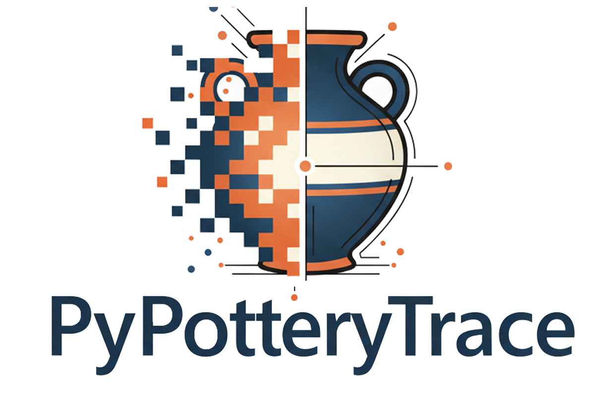

  

PyPotteryTrace converts a scanned pottery drawing into a clean, layered vector drawing. You show the model where the vessel is, it draws the outline, and the app turns that outline into SVG paths, mirrors the profile around the vessel's axis and lets you refine the result before exporting it. This guide follows the five tabs of the app in the order you will normally use them. The **Need help?** button in the header (Pixel) opens this page, and the **Guide** button opens a short summary inside the app.

::: {.callout-note}
## The workflow at a glance
**Projects** (create one, load the drawings) → **Setup** (choose the SAM 2 model) → **Segmentation** (mark each element, set the rotation center, *Generate SVG*) → **SVG Editor** (refine, *Save Modified SVG*) → **Post-Processing** (export the whole project)
:::

<iframe src="../animations/coming_soon.html" name="Workflow overview" title="Animation coming soon: Workflow overview" style="width: 100%; height: 260px; border: none; overflow: hidden;" scrolling="no"></iframe>

## Key terms

| Term | Meaning |
|---|---|
| **SAM 2** | *Segment Anything Model 2*, the model that finds the outline of an object from a few clicks. It comes in four sizes, see [Getting Started](index.qmd#first-launch). |
| **Prompt** | What you give the model to find an object: a **point** (positive or negative) or a **box**. |
| **Mask** | The area of the image that the model (or your polygon) has selected. |
| **Segment** | A mask you have confirmed with **Add Segment**, with a name and a **category**. |
| **Category** | What the element is (Profile, Handle, Decoration, ...). It decides how the segment is vectorized and drawn. |
| **Rotation center** | A point on the vertical axis of the vessel. The profile is mirrored around it to complete the other half. |
| **Layer** | A group of paths in the SVG, one per category (for example `layer_Profile`). |

# Projects

Like the other PyPottery apps, PyPotteryTrace works with **projects**: a project is a folder that keeps your images, segmentations and SVG files together, so you can close the app and pick up the work later. The **Projects** tab lists them as cards.

<iframe src="../animations/coming_soon.html" name="Projects" title="Animation coming soon: Projects" style="width: 100%; height: 260px; border: none; overflow: hidden;" scrolling="no"></iframe>

## Create a project

1. Click **New Project**.
2. Enter a **Project Name** (required), an optional description and one of the six icons.
3. Click **Create Project**.
4. A file dialog opens: select the images of the project (you can choose many at once). You can add more later, in the **Setup** tab.

## Open, refresh and delete

Each card shows the name, the description, how many images were **Uploaded** and how many are **Vectorized**, and the creation and modification dates. Click a card to open the project: the app takes you to the **Setup** tab, and the project name appears in the header (click it to come back to this tab). **Refresh** reloads the list if you changed something outside the app. **Export** downloads the whole project as a ZIP file, and **Import**, at the top of the tab, adds a project from such a ZIP (as a new project): this is how you move a project to another computer or share it. **Delete** removes the project and everything in it (images, masks, vectors and exports) after a confirmation, and cannot be undone. If you reload the page, the project you had open is reopened.

::: {.callout-note}
## Where the files are
Projects live in the `projects/` folder next to the app. Inside each one, `uploads/` holds your original images, `annotations/` the segmentation of each image, and `vectorized/` the SVG files you saved from the editor.
:::

# Setup

Once a project is open, the **Setup** tab shows its images and lets you choose the model.

<iframe src="../animations/coming_soon.html" name="Setup" title="Animation coming soon: Setup" style="width: 100%; height: 260px; border: none; overflow: hidden;" scrolling="no"></iframe>

## Project images

The left panel shows a thumbnail of every image in the project, so you can check that they were all loaded. To add more, drag and drop images onto the drop area, or click it to browse (PNG, JPG, JPEG, BMP and TIFF are supported). Clicking a thumbnail opens that image in the **Segmentation** tab.

## Select the SAM 2 model

The right panel lists the four models:

- **Tiny** (~156 MB): very fast, good accuracy. For old computers and quick tests.
- **Small** (~184 MB): fast, high accuracy. **The default, and enough for most drawings.**
- **Base+** (~323 MB): medium speed, excellent accuracy.
- **Large** (~898 MB): slower, the highest precision. Best kept for a GPU.

When you pick a model that is not on your computer yet, the app asks whether to download it and shows a progress bar; if you cancel, the previous model stays selected. A model that is already downloaded is used immediately.

::: {.callout-tip}
Start with **Small**. Switch to a larger model only if the outline of a difficult drawing is not accurate even after adding more points.
:::

# Segmentation

This is where you tell the app what is in each drawing. The tab has three columns: the tools on the left, the image in the middle, and the list of segments and the export button on the right. Below the image, a strip with the project images lets you move from one drawing to the next. The work is **saved automatically** a moment after every change (a small *Saved* message appears), so switching image or closing the app loses nothing.

<iframe src="../animations/coming_soon.html" name="Segmentation" title="Animation coming soon: Segmentation" style="width: 100%; height: 260px; border: none; overflow: hidden;" scrolling="no"></iframe>

**Moving around the image**: scroll the mouse wheel (or press `+` and `-`) to zoom, drag with the middle mouse button or with `Ctrl` + left button to pan, and use the toolbar under the image to zoom in and out, to **reset the view** and to **undo** (`Ctrl` + `Z`): undo removes the last point, or the last polygon vertex, of the mask you are building.

## Segmentation modes

Choose the mode in **Segmentation Mode** (or with the keyboard):

| Mode | Key | What you do |
|---|---|---|
| **Point Mode** | `P` | Click on the object. Every click updates the mask. |
| **Box Mode** | `B` | Click and drag a rectangle around the object. |
| **Manual Polygon** | `M` | Click the corners of the shape yourself, without the model. |
| **Rotation Center** | `R` | Click on the vessel's axis of symmetry. |

### Point Mode

Choose **Positive** and click inside the object: the model draws its outline. If the mask is too small, click again on the missing part. If it spills over something you do not want (a handle, a decoration, a neighbouring vessel), choose **Negative** and click on that area to remove it. Positive points are drawn in green and negative points in red. **Clear Preview** discards the current mask and starts again.

### Box Mode

Drag a box around the object. It is quicker than points for large, compact shapes, such as a frontal view (*prospectus*).

### Manual Polygon

Use it when the model cannot find the shape. Click to place the vertices; to close the polygon, click on the first vertex, double-click, or press `Enter` (at least three vertices are needed). **Undo Point** (or `Backspace`, or `Esc`) removes the last vertex and **Clear All** removes all of them. The result is a **manual** mask, marked with a badge in the segment list.

### Edit Mask

To fix a mask that is almost right, click **Edit Mask**. The outline becomes a polygon with draggable vertices:

- **drag** a vertex to move it;
- **click** on an edge to add a vertex there;
- **right-click** a vertex to delete it;
- move the **Simplification** slider (1 to 30, 15 by default) to reduce the number of vertices: the higher the value, the fewer the vertices, with a minimum of three.

Click **Done Editing** (or press `Enter`) to keep the changes, or **Cancel** (`Esc`) to go back to the original mask. While you edit, you cannot change tool or image.

### Rotation Center

A profile is drawn on one side of the vessel only: the app mirrors it around the vessel's vertical axis to complete the other half. Switch to this mode and click on the axis: a dashed crosshair follows the cursor, with its coordinates, until you click. The point appears at the top of the **Segments** list, with a **Clear** button to remove it.

::: {.callout-important}
Without a rotation center, **Profile** and **Running element** segments are not mirrored, and no axis or diameter line is drawn. Set it on every drawing that needs a mirrored profile.
:::

## Categories and segments

Once you have a mask you are happy with, describe it in the **Category** panel and click **Add Segment**:

- **Category**: what the element is (see the table below);
- **Element Name**: optional; if you leave it empty, the app numbers the elements for you (*Profile 1*, *Handle 2*, ...);
- **Export Format**: **Vector (SVG)** traces the mask into paths; **Raster (PNG)** keeps it as a transparent image. The app proposes the usual choice for each category, and you can change it.

| Category | What it is | Default format |
|---|---|---|
| **Profile** | The main outline of the vessel | SVG |
| **Application** | Applied elements (spouts, lugs, applied bands) | SVG |
| **Running element** | Continuous patterns along the profile: ridges, grooves, bands | SVG |
| **Handle** | Handles and attachments | PNG |
| **Prospectus** | The frontal or rear view of the vessel | PNG |
| **Decoration** | Painted or incised decoration on the surface | PNG |
| **Detail** | A specific area of interest | PNG |

Every segment appears in the **Segments** list with its name, a coloured icon and, on the canvas, a coloured area for its category. In the list you can still **change the category** or the **SVG/PNG format** of a segment, or **delete** it with the trash icon (after a confirmation). Deleting a segment that turned out badly is often quicker than fixing it.

The **Settings** panel controls how the masks are turned into paths:

| Setting | Range | Default | Effect |
|---|---|---|---|
| **Simplification** | 0.5 to 5 | 1.5 | Higher values give simpler paths with fewer points |
| **Smoothing** | 0 to 1 | 0.3 | Higher values give smoother curves |
| **Line Threshold (Black Level)** | 10 to 240 | 100 | Higher values keep only the darkest lines, lower values also capture faint strokes |

You can also fine-tune the geometry later, in [Post-Processing](#post-processing).

## Generate the SVG

When all the elements of a drawing are in the list, click **Generate SVG**. The app traces every SVG segment, mirrors the profile and its running elements, and opens the result in the **SVG Editor**. (**DEBUG: Export Masks as PNG** saves the masks as PNG files, which is useful only to diagnose a problem.)

## Worked example: a simple vessel

For a vessel with no handles or decoration, one click is enough. Choose **Point Mode**, click a point on the profile, check that the mask covers the whole outline and, if not, add more positive points. Choose the category **Profile** and click **Add Segment**. If you also want the frontal view in the drawing, choose the category **Prospectus**, use **Box Mode** to draw a box around it and click **Add Segment**. Finally, choose **Rotation Center**, click on the vessel's axis and press **Generate SVG**.

## Worked example: a vessel with a handle

With a handle next to the profile, the model tends to include it. Add three positive points along the profile and two negative points on the handle, set the rotation center and try **Generate SVG**. If the outline is wrong, go back to the **Segmentation** tab, delete the segment and redo it: use **Edit Mask** to move the vertices that are in the wrong place, or draw the profile with **Manual Polygon**. Then create the handle as a second segment, with the category **Handle**, drawn with **Manual Polygon**, and generate the SVG again.

# SVG Editor

The **SVG Editor** shows the vector drawing you just generated, with all its paths and points, and lets you correct them by hand. The tab is enabled the first time you generate an SVG.

<iframe src="../animations/coming_soon.html" name="SVG Editor" title="Animation coming soon: SVG Editor" style="width: 100%; height: 260px; border: none; overflow: hidden;" scrolling="no"></iframe>

## Tools

| Tool | What it does |
|---|---|
| **View Mode** | Pan (drag) and zoom (wheel). Dragging an image layer moves it. |
| **Select Mode** | Click a point to select it, `Shift` + click to select several, or drag on an empty area to select the points inside a box. Drag a selected point to move it (with `Shift` the movement is constrained to horizontal or vertical). |
| **Add Point** | Click on a path to insert a new point there. |
| **Delete Mode** | Click a point to remove it. |
| **Continuation Line** | Draws the missing part of a fractured profile (see below). |
| **Internal Details** | Draws straight lines, for example a marked rim or a ridge (see below). |

Points are coloured: **blue** for path points, **purple** for the control points of curves, **orange** under the cursor and **red** when selected. The **Settings** panel changes the **Point Size** and lets you hide the points and their labels.

**Keyboard**: `V`, `S`, `A` and `D` switch to View, Select, Add Point and Delete Mode; `Delete` or `Backspace` remove the selected points, `Ctrl` + `Z` undoes, `Ctrl` + `A` selects all the points, the arrow keys nudge the selection by 1 pixel (10 with `Shift`), `Space` + drag or the middle mouse button pans, and `Esc` cancels a pending action. **Right-click** opens a menu with *Delete Point(s)*, *Deselect All*, *Select All Points*, *Reset View* and *Undo*.

## Continuation Line

A fractured profile stops at the break: this tool proposes how it would have continued.

1. **Outer face.** Click the break point, then a second point further back on the same fragment, beyond the damaged stretch. The app fits a circle through the two points and the break point, and draws the continuation along it, for the length set in **Continuation Length** (20 to 400 px, 100 by default; the arc never turns by more than a quarter of a circle). The line is mirrored to the other side of the axis automatically.
2. **Inner face.** If the profile has a fracture section, the tool then asks for the break point on the inner face, with the same two clicks. This line is *not* mirrored.

The lines go in their own **Reconstruction** layer, with points you can adjust in Select Mode. `Esc` or a right-click cancels the pending break point.

## Internal Details

Click and drag, or click two points, to draw a straight line; the ends snap to nearby points. Hold `Shift` to constrain the line to horizontal or vertical. The lines go in the **Detail** layer. `Esc` or a right-click cancels the line in progress.

## Layers and reference image

The **Layers** panel groups the paths by category (Profile, Profile mirrored, Symmetry line, Diameter, Reconstruction, Detail, ...). Uncheck a layer to hide it: hidden layers are **left out of the saved SVG**. This is useful, for example, for a vessel without a preserved rim, where the app still draws a diameter line: hide it.

Click **Add Reference Image** to place the original drawing under the vectors and check that the tracing is accurate. Each image layer has its own visibility and opacity, and can be removed with the trash icon.

## Save

Under **Export** choose **SVG Only** (transparent background) or **With Image** (the original image is embedded behind the paths at 30% opacity), then click **Save Modified SVG**. The file is saved in the project, in `vectorized/`, as `<image name>_vectorized.svg`, and replaces the previous version. The *Statistics* box shows the number of paths and points, and how many are selected.

::: {.callout-important}
Only the drawings you have **saved from the SVG Editor** are available in the Post-Processing tab. Save every drawing you want to export before moving on.
:::

# Post-Processing

The **Post-Processing** tab exports **all the saved drawings of the project** at once, in publication-ready formats, with the same line weights. It is enabled as soon as a project is open.

<iframe src="../animations/coming_soon.html" name="Post-Processing" title="Animation coming soon: Post-Processing" style="width: 100%; height: 260px; border: none; overflow: hidden;" scrolling="no"></iframe>

## Live Preview Studio

The left panel shows one drawing, updated live as you change the settings on the right. Under the title, the file name is shown in a badge; the buttons let you pick a **Random** drawing, toggle **Original** to compare with the version saved from the editor, zoom, reset the view and switch the background between a dot grid and plain white. The bar at the bottom reports how many **vertices** the drawing has before and after the simplification, with the percentage saved, and how many categories are active.

## Settings

**Geometry & Simplification**

- **Simplification (Epsilon)**, from 0 to 5: at 0 every vertex is kept; higher values give cleaner paths with fewer points.
- **Path Smoothing**, from 0 to 1: at 0 the corners stay sharp; at 1 the curves are smooth.

**Stroke Widths (px)**: the line thickness for each category, so that the drawings match your publication standards. The defaults are 1.0 for Profile/Rim, Application, Handle, Running element and Reconstruction, 0.8 for Decoration and Detail, and 0.5 for the technical lines (Symmetry axis and Diameter line). The **Defaults** button restores them.

**Category Filter**: uncheck the categories you do not want in the export (for example the Reconstruction lines, or the construction lines); the preview updates immediately. A drawing without any selected category is skipped.

## Export

1. **Output Formats**: **SVG** (editable vectors), **PNG** (raster) and **JPG** (compressed). SVG and PNG are on by default.
2. **Export Options**:
    - **Resolution**: 72 (web), 150 (draft), 300 (print, the default) or 600 DPI (archival).
    - **Transparent PNG**: on by default; turn it off to choose a background colour. For JPG, choose the quality (60 to 100%, 90 by default).
    - **Download ZIP Archive**: bundles everything into one file that your browser downloads. If you uncheck it, the files are saved instead in the project, in `exports/export_<date>_<time>/`.
    - **Category Subfolders**: puts each drawing in a folder named after its main category; the SVG, PNG and JPG of a drawing always go in the same folder.
3. Click **Export All Vectorized Files**. A progress bar follows the work, and a window reports how many files were created and where they went.

The files keep the name of the original image (the `_vectorized` ending is removed), with the extension of each format.

# Tips

- **Small is usually enough.** Add a few positive and negative points before switching to a bigger model.
- **Set the rotation center on every drawing** that needs a mirrored profile, and place it on the vessel's axis, not on a guess.
- **Use the right tool for each shape.** Points for irregular shapes, a box for compact ones, a polygon when the model cannot find the outline.
- **Save from the SVG Editor.** A drawing that you generated but did not save is not exported.
- **Keep the drawings light.** Post-processing with Epsilon 0 keeps every vertex; raise it a little if the files are heavy or the lines look wobbly.
