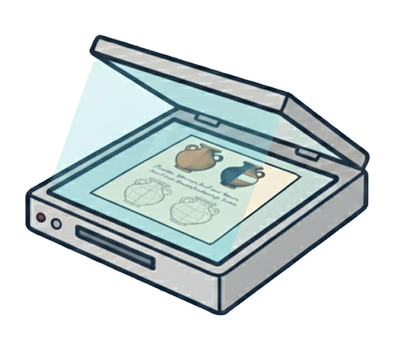
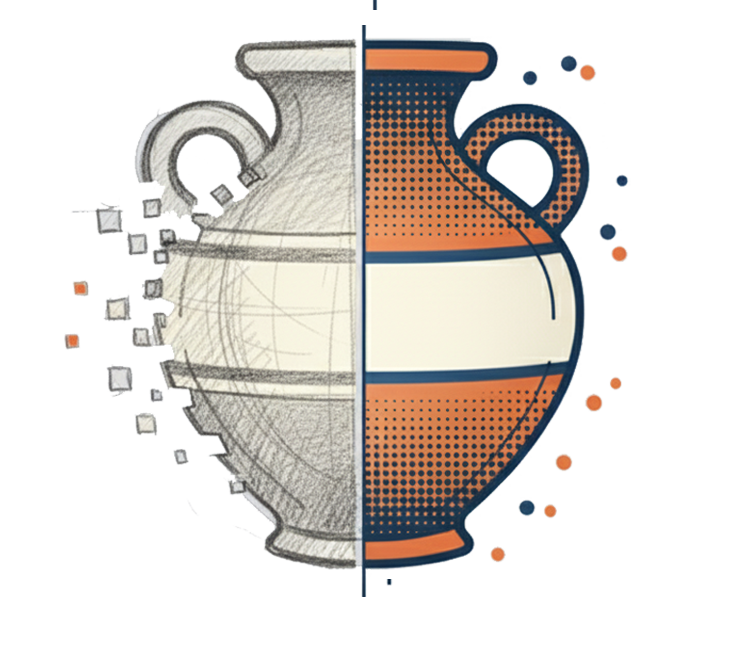
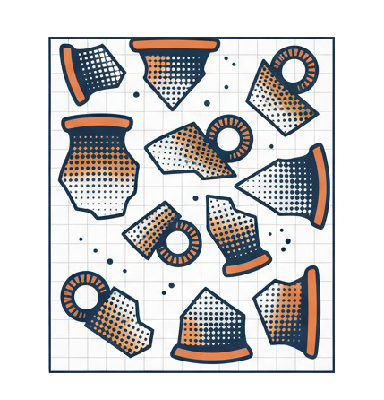

<div align="center">


# PyPottery

**Digitizing archaeological pottery documentation**

Extract, ink, vectorize and lay out ceramic drawings in minutes instead of days.<br>
Five open-source tools that run on your own computer.

[**Documentation**](https://lrncrd.github.io/PyPottery/) &nbsp;·&nbsp;
[**Download**](https://github.com/lrncrd/PyPottery/releases/latest) &nbsp;·&nbsp;
[**Community**](https://lrncrd.github.io/PyPottery/community.html) &nbsp;·&nbsp;
[**Support**](https://ko-fi.com/lrncrd)

[](https://github.com/lrncrd/PyPottery/releases/latest)
[](https://github.com/lrncrd/PyPottery/releases)
[](https://github.com/lrncrd/PyPottery/stargazers)
[](https://lrncrd.github.io/PyPottery/community.html)


</div>

<br>

> [!NOTE]
> **Trace** and **Scan** are currently under review: [PyPotteryTrace](https://github.com/lrncrd/PyPotteryTrace) · [PyPotteryScan](https://github.com/lrncrd/PyPotteryScan)

## What it does

Every manual step of the classical pottery documentation workflow has a digital counterpart in the suite. Use the whole chain, or only the step you need.

<table>
  <tr>
    <td align="center" width="20%"><a href="https://lrncrd.github.io/PyPottery/pypotterylens/"></a></td>
    <td align="center" width="20%"><a href="https://lrncrd.github.io/PyPottery/pypotteryscan/"></a></td>
    <td align="center" width="20%"><a href="https://lrncrd.github.io/PyPottery/pypotteryink/"></a></td>
    <td align="center" width="20%"><a href="https://lrncrd.github.io/PyPottery/pypotterytrace/"></a></td>
    <td align="center" width="20%"><a href="https://lrncrd.github.io/PyPottery/pypotterylayout/"></a></td>
  </tr>
  <tr>
    <td align="center"><b>Lens</b></td>
    <td align="center"><b>Scan</b></td>
    <td align="center"><b>Ink</b></td>
    <td align="center"><b>Trace</b></td>
    <td align="center"><b>Layout</b></td>
  </tr>
  <tr valign="top">
    <td align="center"><sub>Pull vessel drawings out of monograph PDFs</sub></td>
    <td align="center"><sub>Digitize scanned plates and read their labels</sub></td>
    <td align="center"><sub>Turn pencil sketches into publication-ready ink</sub></td>
    <td align="center"><sub>Vectorize profiles into editable SVG with SAM 2</sub></td>
    <td align="center"><sub>Compose plates with consistent scale and captions</sub></td>
  </tr>
  <tr>
    <td align="center"><sub><a href="https://github.com/lrncrd/PyPotteryLens">repo</a></sub></td>
    <td align="center"><sub><a href="https://github.com/lrncrd/PyPotteryScan">repo</a></sub></td>
    <td align="center"><sub><a href="https://github.com/lrncrd/PyPotteryInk">repo</a></sub></td>
    <td align="center"><sub><a href="https://github.com/lrncrd/PyPotteryTrace">repo</a></sub></td>
    <td align="center"><sub><a href="https://github.com/lrncrd/PyPotteryLayout">repo</a></sub></td>
  </tr>
</table>

| Phase | From | To | With |
|---|---|---|---|
| **Capture** | Printed monographs, legacy PDFs, handwritten field cards | Structured drawings and catalogue data | Lens, Scan |
| **Refine** | Faded pencil drawings, raster profiles | Clean ink and vector curves | Ink, Trace |
| **Publish** | Individual vessels | Plates with correct scale bars and captions | Layout |

## Why PyPottery

| | |
|---|---|
| **Save time** | Process hundreds of drawings in batch mode |
| **Consistent** | The same models and settings across your whole corpus |
| **Reproducible** | Every step is documented and shareable |
| **Local and private** | Your unpublished finds stay on your machine, by default |
| **Open source** | Free to use, inspect, modify and extend |

## Quick start

The launcher installs and updates every tool for you. **No Python installation required.**

<p align="center">
  <a href="https://github.com/lrncrd/PyPottery/releases/latest">
    
  </a>
</p>

| Platform | Status | How to install |
|---|---|---|
| **Windows 10/11** (64-bit) | Available | Run `PyPottery-Launcher-Setup.exe`. Start Menu shortcut included |
| **macOS** (Apple Silicon and Intel) | Available | Open the `.dmg` and drag PyPottery Launcher into **Applications** |
| **Linux** | Coming soon | Use the [source install](https://lrncrd.github.io/PyPottery/suite_installation.html#method-b-source-cli) for now |

1. Download the installer for your system from the [latest release](https://github.com/lrncrd/PyPottery/releases/latest).
2. Open the launcher and press **Setup Environment** the first time (it downloads PyTorch for your hardware).
3. **Install** the tools you need and start them from the launcher.

The [Installation Guide](https://lrncrd.github.io/PyPottery/suite_installation.html) covers each platform, the portable packages and the manual install.

> [!TIP]
> **Keep your work safe.** The launcher's **Backup** button exports your Lens, Scan and Trace projects to a single `.zip` and imports them back. Updating a tool keeps its projects, but uninstalling removes them, so export first.

<details>
<summary><b>System requirements</b></summary>

<br>

- **Operating system:** Windows 10/11 or macOS (Linux coming soon)
- **RAM:** 8 GB minimum, 16 GB recommended
- **GPU:** optional but recommended (NVIDIA CUDA or Apple Silicon). Every tool falls back to the CPU
- **Python 3.12** only for the manual installation

</details>

## Documentation

Everything is on **[lrncrd.github.io/PyPottery](https://lrncrd.github.io/PyPottery/)**.

| Guides | |
|---|---|
| [Getting started](https://lrncrd.github.io/PyPottery/suite_installation.html) | Install, first run, update, uninstall |
| [PyPotteryLens](https://lrncrd.github.io/PyPottery/pypotterylens/) · [Scan](https://lrncrd.github.io/PyPottery/pypotteryscan/) · [Ink](https://lrncrd.github.io/PyPottery/pypotteryink/) · [Trace](https://lrncrd.github.io/PyPottery/pypotterytrace/) · [Layout](https://lrncrd.github.io/PyPottery/pypotterylayout/) | One guide per tool, with usage and version history |
| [Open source and community](https://lrncrd.github.io/PyPottery/community.html) | How to take part |

## Contributing

PyPottery is an open-source, collaborative project, and **archaeologists and programmers are equally welcome**. You do not need to write code to help.

<table>
  <tr valign="top">
    <td width="50%">
      <b>If you work with pottery</b>
      <ul>
        <li>Try the tools on your own material and tell us where they fail</li>
        <li>Point out the steps of your workflow still done by hand</li>
        <li>Share sample drawings you have the right to publish</li>
        <li>Help improve the guides and their translations</li>
      </ul>
    </td>
    <td width="50%">
      <b>If you write code</b>
      <ul>
        <li>Fix bugs, add tests, improve performance</li>
        <li>Help verify the suite on macOS and Linux</li>
        <li>Work on the models, or take a feature from the tracker</li>
        <li>Each tool lives in its own repository</li>
      </ul>
    </td>
  </tr>
</table>

**How to start:** check the [issues](https://github.com/lrncrd/PyPottery/issues), open one that describes your idea or problem (for a bigger change, talk about it first), then fork the repository of the tool concerned and send a pull request. More on the [community page](https://lrncrd.github.io/PyPottery/community.html).

## Citation

If you use PyPottery in your research, please cite the software and the article of each module you used. GitHub's **Cite this repository** button reads [`CITATION.cff`](CITATION.cff) for you.

- **PyPotteryLens:** Cardarelli, L. (2025). *PyPotteryLens: An Open-Source Framework for Automated Pottery Digitisation.* Digital Applications in Archaeology and Cultural Heritage, 36, e00380. [doi:10.1016/j.daach.2025.e00380](https://doi.org/10.1016/j.daach.2025.e00380)
- **PyPotteryInk:** Cardarelli, L. (2025). *PyPotteryInk: A One-Step Diffusion Model for Archaeological Drawing Vectorization.* Journal of Cultural Heritage, 72. [doi:10.1016/j.culher.2025.01.010](https://doi.org/10.1016/j.culher.2025.01.010)

<details>
<summary><b>BibTeX for the suite</b></summary>

```bibtex
@software{cardarelli2025pypottery,
  title = {{PyPottery Suite: Digitizing Archaeological Pottery Documentation}},
  author = {Cardarelli, Lorenzo},
  year = {2025},
  url = {https://github.com/lrncrd/PyPottery}
}
```

</details>

## Contact and support

**Lorenzo Cardarelli** · [lorenzo.cardarelli@uni-goettingen.de](mailto:lorenzo.cardarelli@uni-goettingen.de)

Interested in a research collaboration or in custom model training? [Get in touch](https://lrncrd.github.io/PyPottery/contact.html).

If PyPottery is useful for your research, you can help keep it maintained:

<p align="center">
  <a href="https://ko-fi.com/lrncrd"></a>
</p>

<p align="center"><sub>© 2024–2026 Lorenzo Cardarelli · Built by archaeologists, for archaeologists</sub></p>
