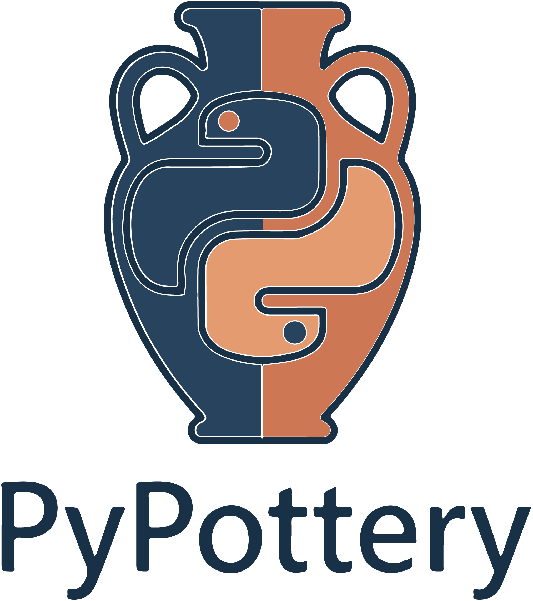
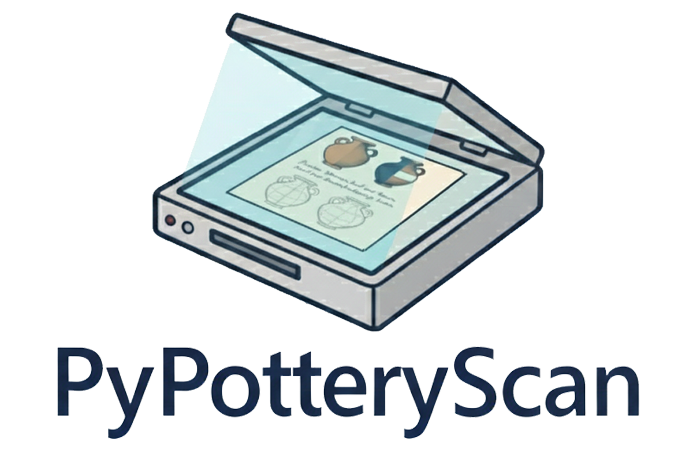

<p align="center">
  
</p>

<h1 align="center">PyPottery</h1>

<p align="center">
  <strong>🏺 Digitizing Archaeological Pottery Documentation</strong>
</p>

<p align="center">
  <a href="https://lrncrd.github.io/PyPottery/">📖 Documentation</a> •
  <a href="#-quick-start">🚀 Quick Start</a> •
  <a href="#-tools">🛠️ Tools</a> •
  <a href="https://lrncrd.github.io/PyPottery/community.html">🤝 Community</a> •
  <a href="https://ko-fi.com/lrncrd">☕ Support</a>
</p>

<p align="center">
  <a href="https://github.com/lrncrd/PyPottery/releases/latest">
    
  </a>
  <a href="https://github.com/lrncrd/PyPottery/releases">
    
  </a>
  <a href="https://github.com/lrncrd/PyPottery/stargazers">
    
  </a>
  <a href="https://github.com/lrncrd/PyPottery/commits">
    
  </a>
</p>

<p align="center">
  
  
  
  
</p>

> [!NOTE]
> **Under Review**: The **Trace** and **Scan** tools are currently under review. [Trace Repository](https://github.com/lrncrd/PyPotteryTrace) • [Scan Repository](https://github.com/lrncrd/PyPotteryScan)

---

## 🏺 About

**PyPottery** brings traditional archaeological pottery documentation into the digital age. Each manual step in the classical workflow finds its digital counterpart in our suite of specialized tools.

What takes hours manually can be done in minutes. Process hundreds of drawings with consistent, reproducible results.

PyPottery is an **open-source, community-driven project**: it is built for archaeologists, and it improves with the help of both archaeologists and programmers. See [how to take part](#-contributing).

### Why PyPottery?

| Feature | Description |
|---------|-------------|
| ⚡ **Save Time** | Process hundreds of drawings in batch mode |
| 🎯 **Consistent Quality** | AI models ensure uniform results across your entire corpus |
| 🔄 **Reproducible** | Every step is documented and shareable |
| 🆓 **Open Source** | Free to use, inspect, modify, and extend, with the whole source code public |
| 🔒 **Local & Private** | Everything runs on your own machine by default |

---

## 🛠️ Tools

### PyPotteryInk


**AI-powered inking of pottery drawings**

Transform rough pencil sketches into clean, publication-ready ink drawings in seconds. Supports CPU, NVIDIA CUDA, and Apple Silicon (MPS).

- Image inking in seconds
- All hardware compatibility
- Batch processing support
- Pretrained models available

**[📖 Documentation](https://lrncrd.github.io/PyPottery/pypotteryink/)** | **[💾 Repository](https://github.com/lrncrd/PyPotteryInk)**

<br clear="left"/>

---

### PyPotteryLayout


**Create publication-ready layouts automatically**

Arrange multiple pottery drawings with consistent scaling and professional formatting. Export to PDF and SVG.

- Automatic layout generation
- Consistent scaling system
- Publication-ready exports
- SVG export for further editing

**[📖 Documentation](https://lrncrd.github.io/PyPottery/pypotterylayout/)** | **[💾 Repository](https://github.com/lrncrd/PyPotteryLayout)**

<br clear="left"/>

---

### PyPotteryLens


**Extract pottery images from PDF documents**

Already have published PDFs? Extract pottery images directly from existing documents using computer vision.

- PDF to image conversion
- Computer vision model application
- Annotation review & editing
- Standardized image export

**[📖 Documentation](https://lrncrd.github.io/PyPottery/pypotterylens/)** | **[💾 Repository](https://github.com/lrncrd/PyPotteryLens)**

<br clear="left"/>

---

### PyPotteryScan


**Digitize scanned pottery plates and read their labels**

Mark the vessels and their labels on each scanned plate, read the text with a local OCR model, and export the cleaned drawings together with a catalogue.

- Drawing and label annotation
- Local OCR of the labels
- Drawing cleanup and review
- Export to ZIP, Excel and CSV

**[📖 Documentation](https://lrncrd.github.io/PyPottery/pypotteryscan/)** | **[💾 Repository](https://github.com/lrncrd/PyPotteryScan)**

<br clear="left"/>

---

### PyPotteryTrace


**Vectorize vessel profiles with a few clicks**

Mark a vessel on a scanned drawing, let Segment Anything Model 2 (SAM 2) find its outline, and get an editable SVG.

- Click, box or polygon segmentation
- Profile mirroring and editing
- Continuation lines for fractured profiles
- SVG, PNG and JPG export

**[📖 Documentation](https://lrncrd.github.io/PyPottery/pypotterytrace/)** | **[💾 Repository](https://github.com/lrncrd/PyPotteryTrace)**

<br clear="left"/>

---

## 🚀 Quick Start

### Option 1: PyPottery Suite Launcher (Recommended)

The easiest way to get started! Download the pre-packaged launcher with everything included - **no Python installation required**.

<p align="center">
  <a href="https://github.com/lrncrd/PyPottery/releases/latest">
    
  </a>
</p>

| Platform | Status | Install |
|----------|--------|---------|
| **Windows 10/11** (64-bit) | ✅ Available | Run `PyPottery-Launcher-Setup.exe` — normal setup wizard, Start Menu shortcut included |
| **macOS** | ✅ Available | Open the `.dmg` and drag PyPottery Launcher into **Applications** |
| **Linux** | 🚧 Coming Soon | — |

**Installation:**
1. Grab the installer for your OS from [Releases](https://github.com/lrncrd/PyPottery/releases/latest)
2. Run it (Windows) or drag-to-Applications (macOS) — no Python install required
3. See [Installation Guide](https://lrncrd.github.io/PyPottery/suite_installation.html) for details

**Keeping your work safe:** the launcher's **Backup** button exports your Lens, Scan and Trace projects to a single `.zip` file and imports them back. Projects are also kept when an app is updated, but they are removed if you uninstall an app, so export them first.

### Option 2: Manual Installation

For advanced users who want more control, each tool can be installed separately. See the [Installation Guide](https://lrncrd.github.io/PyPottery/suite_installation.html) for detailed instructions.

---

## 📋 Requirements

- **Python 3.12** (for manual installation)
- **Operating System:** Windows 10/11 or macOS (Linux coming soon)
- **RAM:** 8 GB minimum, 16 GB recommended
- **GPU:** Optional but recommended (NVIDIA CUDA or Apple Silicon)

---

## 📖 Documentation

Full documentation is available at **[lrncrd.github.io/PyPottery](https://lrncrd.github.io/PyPottery/)**

- [Getting Started](https://lrncrd.github.io/PyPottery/suite_installation.html)
- [PyPotteryInk Guide](https://lrncrd.github.io/PyPottery/pypotteryink/)
- [PyPotteryLens Guide](https://lrncrd.github.io/PyPottery/pypotterylens/)
- [PyPotteryScan Guide](https://lrncrd.github.io/PyPottery/pypotteryscan/)
- [PyPotteryLayout Guide](https://lrncrd.github.io/PyPottery/pypotterylayout/)
- [PyPotteryTrace Guide](https://lrncrd.github.io/PyPottery/pypotterytrace/)
- [Open Source & Community](https://lrncrd.github.io/PyPottery/community.html)

---

## 🤝 Contributing

PyPottery is an open-source and collaborative project, and **archaeologists and programmers are equally welcome**. You do not need to write code to help.

**If you are an archaeologist or an illustrator**
- Try the tools on your own material and tell us where they fail or what is missing
- Suggest steps of your workflow that are still done by hand
- Share sample drawings (that you have the right to share) to test and train the models
- Help improve the documentation and its translations

**If you are a programmer or a data scientist**
- Fix bugs, add tests, improve performance
- Help verify the suite on **macOS and Linux**
- Contribute to the models, or take on a new feature (each tool lives in its own repository)

**How to start**
1. Check the [Issues](https://github.com/lrncrd/PyPottery/issues) to see if your idea or problem is already there
2. Open an issue that describes it (for a bigger change, talk about it first)
3. Fork the repository of the tool concerned and submit a pull request

More details, and the repository of every tool, are on the [Open Source & Community](https://lrncrd.github.io/PyPottery/community.html) page.

---

## 📚 Citation

If you use PyPottery in your research, please cite the software and the article of each module you used. GitHub's **Cite this repository** button (right sidebar) reads [`CITATION.cff`](CITATION.cff) and gives you APA and BibTeX entries.

```bibtex
@software{cardarelli2025pypottery,
  title = {{PyPottery Suite: Digitizing Archaeological Pottery Documentation}},
  author = {Cardarelli, Lorenzo},
  year = {2025},
  url = {https://github.com/lrncrd/PyPottery}
}
```

- **PyPotteryLens**: Cardarelli, L. (2025). *PyPotteryLens: An Open-Source Framework for Automated Pottery Digitisation.* Digital Applications in Archaeology and Cultural Heritage, 36, e00380. [doi:10.1016/j.daach.2025.e00380](https://doi.org/10.1016/j.daach.2025.e00380)
- **PyPotteryInk**: Cardarelli, L. (2025). *PyPotteryInk: A One-Step Diffusion Model for Archaeological Drawing Vectorization.* Journal of Cultural Heritage, 72. [doi:10.1016/j.culher.2025.01.010](https://doi.org/10.1016/j.culher.2025.01.010)

---

## 📧 Contact

**Lorenzo Cardarelli**  
📧 [lorenzo.cardarelli@uni-goettingen.de](mailto:lorenzo.cardarelli@uni-goettingen.de)

Interested in research collaboration or custom model training? [Get in touch!](https://lrncrd.github.io/PyPottery/contact.html)

---

## ☕ Support This Project

If you find PyPottery useful for your research, consider supporting its development:

<p align="center">
  <a href="https://ko-fi.com/lrncrd">
    
  </a>
</p>

Your support helps maintain and improve this open-source tool for the archaeological community! 🙏

---


<p align="center">
  <sub>© 2024–2026 Lorenzo Cardarelli</sub>
</p>
